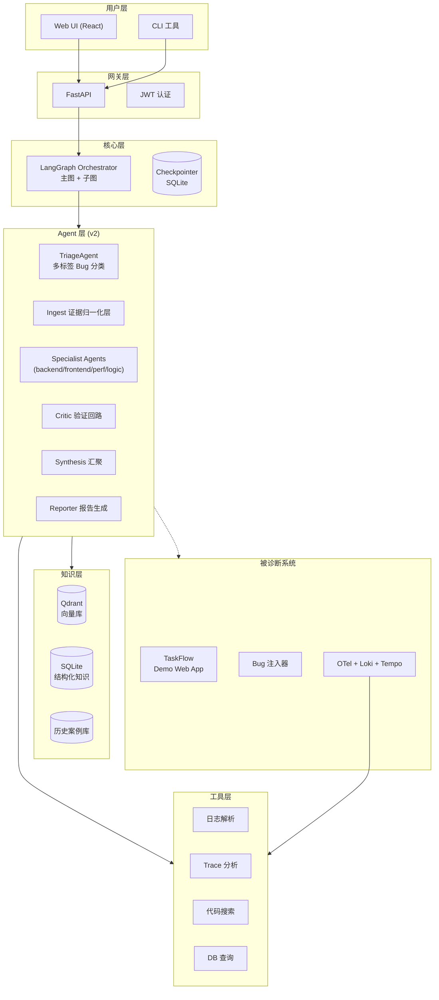

# 🩺 DiagDoctor — AI 驱动的 Web 应用 Bug 诊断助手

> 给定一个出错的 Web 应用 + 错误现象描述 + 日志/Trace 数据，**自动定位根因并给出修复建议**。

[](https://github.com/your-org/DiagDoctor/actions/workflows/ci.yml)
[](https://www.python.org/)
[](https://www.typescriptlang.org/)
[](LICENSE)

---

## 📖 项目简介

**DiagDoctor** 是一个通用 Web 应用 Bug 诊断助手。它由 **3 个独立子系统** 组成：

| 子系统 | 路径 | 职责 |
|--------|------|------|
| **demo-app** | `demo-app/` | 被诊断的目标 Web 应用 — TaskFlow 任务管理系统（FastAPI + React） |
| **bug-factory** | `bug-factory/` | Bug 生成与注入工厂（AI 自动制造 Bug，可量产评测数据） |
| **doctor** | `doctor/` | 诊断 Agent 主体（LangGraph 多 Agent 协作 + RAG 知识库） |

### 核心能力

| 演示场景 | 描述 |
|---------|------|
| 🔴 **前端报错诊断** | 上传崩溃截图 + 控制台日志 → Agent 定位代码行 + 修复建议 |
| 🟠 **后端 API 异常** | 给定错误响应 + 请求日志 → 沿调用链追溯根因 |
| 🟡 **性能瓶颈** | 报告"页面加载慢" → 分析 Trace 找出慢 SQL / 慢接口 |
| 🟢 **数据不一致** | 报告"数据显示不对" → 对照业务流程定位逻辑错误 |

### 区别于传统诊断工具

| 维度 | 传统诊断工具 | DiagDoctor |
|------|------------|------------|
| Bug 来源 | 真实生产 Bug（稀缺） | **AI 自动生成 + 注入**（可控、可量产） |
| 诊断方式 | 人工 GDB/CDB 调试 | **LangGraph 多 Agent 自动协作** |
| 知识库 | 领域专有 | **RAG 通用知识库 + 历史案例自学习** |
| 评测体系 | 无/手动 | **自动化 Harness（50+ 案例，准确率 ≥ 75%）** |
| 部署 | 企业内网 | **Docker Compose 一键启动 + K8s Helm** |

---

## 🏗️ 系统架构



---

## 🚀 一键启动

### 前置条件

- [Docker](https://docs.docker.com/get-docker/) & [Docker Compose](https://docs.docker.com/compose/install/) v2+
- [uv](https://docs.astral.sh/uv/)（Python 包管理器，仅本地开发需要）
- [pnpm](https://pnpm.io/)（仅前端本地开发需要）

### 快速开始（5 分钟）

```bash
# 1. 克隆仓库
git clone https://github.com/your-org/DiagDoctor.git
cd DiagDoctor

# 2. 一键启动所有服务
make up

# 3. 初始化数据库
make demo-migrate

# 4. 种入演示数据
make demo-seed

# 5. 打开浏览器
#    TaskFlow 前端:  http://localhost:3000
#    Grafana 监控:   http://localhost:3001  (admin/admin)
#    Doctor API 文档: http://localhost:8001/docs
#    Demo API 文档:   http://localhost:8000/docs
```

> 也可以一条命令搞定首次初始化：`make setup` = `make up` + `make demo-migrate` + `make demo-seed`

### 启动的服务一览

| 服务 | 端口 | 说明 |
|------|------|------|
| **demo-frontend** | `3000` | TaskFlow 前端 (React + shadcn/ui) |
| **demo-backend** | `8000` | TaskFlow API (FastAPI) |
| **doctor-api** | `8001` | 诊断 Agent API |
| **postgres** | `5432` | PostgreSQL 16 |
| **redis** | `6379` | Redis 7 |
| **grafana** | `3001` | Grafana 监控面板 (admin/admin) |
| **loki** | `3100` | 日志聚合 |
| **tempo** | `3200` | Trace 存储 |
| **otel-collector** | `4317/4318` | OpenTelemetry 采集器 |
| **qdrant** | `6333/6334` | 向量数据库 |

### 常用命令

```bash
make up             # 启动所有服务
make down           # 停止所有服务
make ps             # 查看服务状态
make logs           # 查看所有日志
make doctor-logs    # 查看 Doctor 日志
make clean          # 停止并清除数据卷
make setup          # 首次初始化（启动 + 迁移 + 种子数据）
```

---

## ✅ 当前开发阶段：Sprint 1-2 完成，Sprint 3 待实现

> **Sprint 1-2（W1-W4）已基本完成**：基础设施 + Bug Factory + 评测雏形。
> 详细开发状态见 `docs/architecture-diff-and-changes.md`。

### Demo App（TaskFlow 任务管理）

| 模块 | 功能 | 状态 |
|------|------|------|
| **后端 API** | FastAPI + SQLAlchemy 2.x 异步 | ✅ |
| **数据模型** | User、Project、Task、Comment、Tag（含多对多） | ✅ |
| **认证** | JWT 注册/登录 + `get_current_user` 依赖注入 | ✅ |
| **项目管理** | CRUD `/api/projects/` | ✅ |
| **任务管理** | CRUD + 按项目筛选 `/api/tasks/` | ✅ |
| **评论系统** | 任务评论 `/api/tasks/{tid}/comments` | ✅ |
| **前端 UI** | React 18 + shadcn/ui + Tailwind CSS | ✅ |
| **路由** | 登录/注册/项目列表/看板/任务详情 | ✅ |
| **状态管理** | Zustand (authStore) + TanStack Query | ✅ |
| **拖拽看板** | 3 列看板 (todo/doing/done) + @dnd-kit 拖拽 | ✅ |
| **错误边界** | ErrorBoundary + console.error 结构化标记 `[TAG]` | ✅ |
| **Sentry 集成** | @sentry/react（可配置 DSN） | ✅ |
| **数据库迁移** | Alembic + 自动生成迁移 | ✅ |
| **种子数据** | 30 个任务 + 2 个用户 + 示例项目 | ✅ |

### Doctor 诊断 Agent

| 模块 | 功能 | 状态 |
|------|------|------|
| **项目骨架** | FastAPI + LangGraph + Pydantic v2 | ✅ |
| **诊断接口** | `POST /api/diagnose` 接收 Evidence → 结构化报告 | ✅ |
| **LangGraph State** | DoctorState TypedDict + Finding/Hypothesis/DiagnosisReport | ✅ |
| **最小 Graph** | Triage → Reporter 管道（含 SqliteSaver Checkpointer） | ✅ |
| **流式输出** | `?stream=true` astream_events v2 支持 | ✅ |
| **结构化日志** | structlog + trace_id/session_id 自动注入 | ✅ |
| **成本核算** | TokenAccountant 按 model 统计 | ✅ |
| **OTel 追踪** | @traced 装饰器 + OpenTelemetry 集成 | ✅ |
| **安全模块** | 路径沙箱、子进程参数校验、LLM 脱敏、SecretStr | ✅ |
| **可观测性工具** | Loki 日志查询、Tempo Trace 搜索/详情 | ✅ |
| **知识库** | Qdrant 向量库 + SQLite 结构化知识 + 混合检索 | ✅ |
| **Embedding** | OpenAI 兼容 API / 本地 sentence-transformers (bge-m3) | ✅ |
| **知识初始化** | YAML 种子数据 → Qdrant collection 自动创建 | ✅ |

### 可观测性栈

| 组件 | 功能 | 状态 |
|------|------|------|
| **OTel Collector** | OTLP gRPC/HTTP 接收 → Loki + Tempo 导出 | ✅ |
| **Loki** | 日志聚合存储（filesystem） | ✅ |
| **Tempo** | Trace 存储（OTLP receiver） | ✅ |
| **Grafana** | 数据源自动配置 + Demo Dashboard | ✅ |

### 基础设施

| 组件 | 功能 | 状态 |
|------|------|------|
| **Docker Compose** | 10 个服务一键编排 | ✅ |
| **Makefile** | up/down/logs/migrate/seed/setup | ✅ |
| **CI (GitHub Actions)** | ruff check + format + mypy strict + pytest (Python 3.11/3.12) | ✅ |
| **多阶段 Dockerfile** | demo-backend, demo-frontend, doctor-api | ✅ |

---

## 🧪 测试 Doctor API

```bash
# 基础诊断请求
curl -X POST http://localhost:8001/api/diagnose \
  -H "Content-Type: application/json" \
  -d '{
    "evidence": {
      "user_report": "登录后页面崩溃，控制台显示 TypeError"
    }
  }'

# 流式输出
curl -X POST "http://localhost:8001/api/diagnose?stream=true" \
  -H "Content-Type: application/json" \
  -d '{
    "evidence": {
      "user_report": "创建任务时返回 500 错误",
      "logs": [],
      "traces": []
    }
  }'
```

---

## 📋 Sprint 1 验收清单

> 必须全部通过才能进入 Sprint 2

- [x] `make up` 启动所有服务（postgres、redis、demo-backend、demo-frontend、otel-collector、loki、tempo、grafana、qdrant、doctor-api）
- [x] 浏览器访问 http://localhost:3000 完整使用 TaskFlow
- [x] Grafana (http://localhost:3001) 中能看到 demo-backend 的日志和 trace
- [x] `curl -X POST http://localhost:8001/api/diagnose` 端到端跑通，返回结构化报告
- [x] CI 全绿（ruff check + format + mypy strict + pytest）
- [x] mypy strict 模式无错误

---

## 🗺️ 开发路线图

### ✅ Sprint 1：基础设施（D1-D10）— 已完成

- Demo App 前后端骨架（TaskFlow 任务管理）
- 数据库模型 + Alembic 迁移
- JWT 认证 + RESTful API
- Docker Compose 全栈编排
- OpenTelemetry + Loki + Tempo + Grafana 可观测性栈
- Doctor 项目骨架 + LangGraph 最小 Graph
- 知识库基础设施（Qdrant + SQLite + 混合检索）
- CI/CD 流水线（GitHub Actions）

### 🔜 Sprint 2：Bug Factory + Harness 评测雏形（D11-D20）

| 任务 | 描述 |
|------|------|
| Bug 配方系统 | Pydantic Schema + YAML 配方定义（≥ 15 个配方） |
| Bug Injector | AI 代码改写 + Git 分支管理 + Diff 应用 |
| Trigger Runner | E2E 操作执行器（Playwright + aiohttp） |
| Evidence Collector | Loki/Tempo 自动采集证据 |
| Case Generator | 配方 → 评测案例自动生成 |
| Harness Runner | 批量评测 + 并行执行 |
| Evaluators | Exact Match / Keyword / LLM Judge 评分器 |
| Report Generators | Markdown + HTML Dashboard |

### 🔜 Sprint 3：核心 Agent 系统（D21-D30）

| Agent | 职责 |
|-------|------|
| TriageAgent | Bug 分类（6 个类别） |
| BackendLogAgent | 后端日志分析 ReAct Agent |
| FrontendLogAgent | 前端崩溃 / console 分析 |
| TraceAgent | 分布式调用链分析 |
| PerfAgent | 性能瓶颈定位（N+1、慢 SQL、缓存） |
| LogicAgent | 业务逻辑错误分析 |
| ReporterAgent | 综合诊断报告生成 |

### 🔜 Sprint 4：代码定位 + 部署 + 演示（D31-D40）

| 任务 | 描述 |
|------|------|
| 代码索引 | tree-sitter 解析 → Qdrant 向量化 |
| CodeFixAgent | 代码级定位 + 修复建议 |
| K8s 部署 | Helm Chart + Ingress + HPA |
| 评测调优 | 准确率 ≥ 75%，评测集 ≥ 50 case |
| 完整文档 | 架构/开发/部署/API/安全 7+ 份文档 |
| 演示物料 | 视频 + PPT + 技术分享 |

---

## 🛠️ 技术栈

### Python（后端 + Agent + 评测）
```yaml
version: "3.11+"
package_manager: uv
framework: FastAPI + Pydantic v2 + SQLAlchemy 2.x
agent: LangGraph + LangChain
vector_db: Qdrant
observability: OpenTelemetry + structlog
test: pytest + pytest-asyncio
linter: ruff + mypy --strict
```

### TypeScript（前端）
```yaml
version: "5.x"
package_manager: pnpm
framework: React 18 + Vite
ui: shadcn/ui + Tailwind CSS
state: Zustand
data_fetching: TanStack Query
e2e: Playwright
```

### 基础设施
```yaml
database: PostgreSQL 16
cache: Redis 7
observability: Loki + Tempo + Grafana + OpenTelemetry Collector
deploy: Docker Compose → K8s + Helm
ci: GitHub Actions
```

---

## 📁 项目结构

```
DiagDoctor/
├── demo-app/                  # 被诊断系统
│   ├── backend/               # FastAPI（TaskFlow API）
│   │   ├── app/
│   │   │   ├── main.py        # FastAPI 入口
│   │   │   ├── config.py      # Pydantic Settings
│   │   │   ├── database.py    # SQLAlchemy async session
│   │   │   ├── observability.py # OTel 初始化
│   │   │   ├── models/        # SQLAlchemy 模型
│   │   │   ├── schemas/       # Pydantic schema
│   │   │   ├── api/           # 路由
│   │   │   ├── services/      # 业务逻辑
│   │   │   └── auth/          # JWT 认证
│   │   ├── alembic/           # 数据库迁移
│   │   └── tests/
│   └── frontend/              # React + shadcn/ui + Vite
│       └── src/
│           ├── components/    # 组件（含 ui/ shadcn 组件）
│           ├── pages/         # 页面
│           ├── stores/        # Zustand stores
│           ├── services/      # API 调用层
│           └── types/         # TypeScript 类型
├── bug-factory/               # Bug 生成系统
│   ├── recipes/               # Bug 配方 YAML
│   └── src/                   # injector, trigger, evidence collector
├── doctor/                    # 诊断 Agent
│   ├── src/
│   │   ├── main.py
│   │   ├── config.py
│   │   ├── api/               # diagnose, health
│   │   ├── graph/             # LangGraph 定义
│   │   │   ├── main_graph.py
│   │   │   ├── state.py
│   │   │   ├── nodes/
│   │   │   └── subgraphs/
│   │   ├── tools/             # Agent 工具
│   │   ├── knowledge/         # 知识库（Qdrant + SQLite）
│   │   ├── observability/     # 日志/成本/追踪
│   │   ├── prompts/           # Jinja2 模板
│   │   └── security/          # 安全模块
│   ├── seed_data/             # 初始知识 YAML
│   └── tests/
├── benchmark/                 # 评测系统
├── infra/                     # 部署配置
│   ├── docker-compose.yml
│   ├── otel/collector.yaml
│   ├── loki/config.yaml
│   ├── tempo/config.yaml
│   ├── grafana/               # Dashboard + 数据源
│   └── postgres/init-db.sql
├── docs/                      # 设计文档
│   ├── diagdoctor-from-scratch.md      # 架构总览
│   ├── diagdoctor-execution-handbook.md # 逐日开发手册
│   └── agent-dev-notes/                # 任务面试准备笔记
├── scripts/                   # 辅助脚本
├── Makefile                   # 开发命令
└── pyproject.toml             # Workspace 配置
```

---

## 📚 文档索引

| 文档 | 路径 | 说明 |
|------|------|------|
| 架构总览 | `docs/diagdoctor-from-scratch.md` | 完整架构设计 + 技术决策 |
| 执行手册 | `docs/diagdoctor-execution-handbook.md` | 8 周逐日任务卡片 |
| Docker 排错 | `docs/docker-network-fixes.md` | Docker 网络问题排查 |
| AI 编程技巧 | `docs/ai-assisted-dev-tips.md` | AI 辅助编程最佳实践 |

---

## 🤝 贡献指南

### 命名规范

| 语言 | 类型 | 规范 | 示例 |
|------|------|------|------|
| Python | 文件 | `snake_case` | `task_service.py` |
| Python | 类 | `PascalCase` | `TaskService` |
| Python | 函数/变量 | `snake_case` | `get_task_by_id` |
| TypeScript | 组件文件 | `PascalCase` | `TaskBoard.tsx` |
| TypeScript | 工具/服务文件 | `kebab-case` | `api-client.ts` |
| TypeScript | 组件 | `PascalCase` | `TaskCard` |
| TypeScript | 函数/变量 | `camelCase` | `fetchTasks` |

### Commit 规范（Conventional Commits）

```
feat(scope): description    # 新功能
fix(scope): description     # 修复
docs: description           # 文档
chore: description          # 杂务
refactor(scope): description # 重构
test(scope): description    # 测试
```

Scope: `doctor`, `demo-app`, `bug-factory`, `benchmark`, `infra`

---

## 📄 License

MIT © 2026