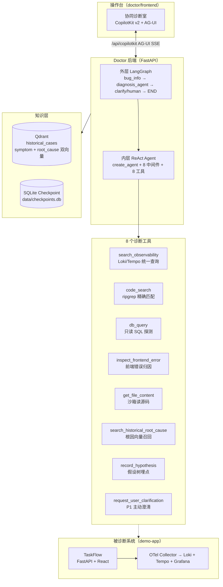

# 🩺 DiagDoctor — AI 驱动的 Web 应用 Bug 诊断 Agent

> 给定一个出错的 Web 应用 + 错误现象描述 + 日志/Trace 数据，**自动定位根因并给出修复建议**。

[](https://www.python.org/)
[](https://www.typescriptlang.org/)
[](LICENSE)

---

## 📖 项目简介

**DiagDoctor** 是一个面向 Web 应用的 Bug 诊断 Agent。它不是“挂一个 LLM 聊天框”，而是把**证据归一化、受限的 ReAct 工具循环、上下文工程、长期记忆、人在回路（HITL）**这五件事工程化落地的一个完整 Agent 系统。由 3 个独立子系统组成：

| 子系统 | 路径 | 职责 |
|--------|------|------|
| **demo-app** | `demo-app/` | 被诊断的目标 Web 应用 — TaskFlow 任务管理系统（FastAPI + React），全链路 OTel 接入 Loki/Tempo |
| **bug-factory** | `bug-factory/` | Bug 生成与注入工厂 — AI 改写代码注入 Bug + 自动触发 + 收集证据，量产评测数据 |
| **doctor** | `doctor/` | 诊断 Agent 主体 — `doctor/backend`（LangGraph + LangChain ReAct）+ `doctor/frontend`（CopilotKit v2 操作台） |

### 核心能力

| 演示场景 | 描述 |
|---------|------|
| 🔴 **前端报错诊断** | 上传崩溃截图 / 控制台日志 → Agent 定位代码行 + 修复建议 |
| 🟠 **后端 API 异常** | 给定错误响应 + 请求日志 → 沿调用链追溯根因 |
| 🟡 **性能瓶颈** | 报告“页面加载慢” → 分析 Trace 找出慢 SQL / N+1 / 慢接口 |
| 🟢 **数据/逻辑不一致** | 报告“数据显示不对” → 主动 SQL 探测 + 代码对照定位逻辑错误（IDOR、静默丢数据等无报错 Bug） |

### 区别于传统诊断工具

| 维度 | 传统诊断工具 | DiagDoctor |
|------|------------|------------|
| Bug 来源 | 真实生产 Bug（稀缺、不可控） | **AI 自动生成 + 注入**（可控、可量产、带金标准） |
| 诊断方式 | 人工 GDB / 翻日志 | **受限 ReAct Agent**（8 工具 + 8 中间件 + 预算硬门） |
| 知识沉淀 | 无 | **双向量长期记忆**（症状相似 + 根因检索 + 👍 反馈闭环） |
| 上下文管理 | 全塞进 prompt | **分层上下文工程**（符号占位可重取 + 静态截断 + 四维预算） |
| 评测体系 | 无 / 手动 | **Langfuse 评测**（15 case × 7 维度，mean overall 0.909） |
| 部署 | — | **Docker Compose 一键启动**（12 服务全栈） |

---

## 🏗️ 系统架构


```mermaid
flowchart TB
    subgraph Operator["操作台（doctor/frontend）"]
        Console["协同诊断室<br/>CopilotKit v2 + AG-UI"]
    end

    subgraph Doctor["Doctor 后端（FastAPI）"]
        OuterGraph["外层 LangGraph<br/>bug_info → diagnosis_agent → clarify/human → END"]
        Inner["内层 ReAct Agent<br/>create_agent + 8 中间件 + 8 工具"]
        OuterGraph --> Inner
    end

    subgraph Knowledge["知识层"]
        Qdrant[("Qdrant<br/>historical_cases<br/>symptom + root_cause 双向量")]
        Checkpoint[("SQLite Checkpoint<br/>data/checkpoints.db")]
    end

    subgraph Tools["8 个诊断工具"]
        Obs["search_observability<br/>Loki/Tempo 统一查询"]
        Code["code_search<br/>ripgrep 精确匹配"]
        DB["db_query<br/>只读 SQL 探测"]
        FE["inspect_frontend_error<br/>前端错误归因"]
        File["get_file_content<br/>沙箱读源码"]
        Rag["search_historical_root_cause<br/>根因向量召回"]
        Hyp["record_hypothesis<br/>假设树埋点"]
        Clar["request_user_clarification<br/>P1 主动澄清"]
    end

    subgraph Target["被诊断系统（demo-app）"]
        TaskFlow["TaskFlow<br/>FastAPI + React"]
        ObsStack["OTel Collector → Loki + Tempo + Grafana"]
        TaskFlow --> ObsStack
    end

    Console <-->|"/api/copilotkit AG-UI SSE"| Doctor
    Doctor --> Knowledge
    Inner --> Tools
    Tools -.-> Target
```

---

## 🧠 Doctor Agent 工程深度

这是项目的核心，也是简历重点。以下每一项都有对应代码实现。

### 1. 受限 ReAct 循环（不是裸 LLM）

外层 LangGraph 由 4 个节点构成，带条件路由（[engine/nodes/diagnosis_agent.py](doctor/backend/src/engine/nodes/diagnosis_agent.py)）：

```
START → bug_info → [route]
                    ├─ rounds_exhausted ────────────────────────→ END（P2 硬门）
                    └─ → diagnosis_agent → [route]
                                         ├─ clarification_requested & count<MAX → clarify_input → diagnosis_agent
                                         ├─ early_stopped & !hitl_resumed    → human_input   → diagnosis_agent
                                         └─ else                              → END
```

内层 ReAct Agent 由 LangChain `create_agent` 构建，挂载 **8 个中间件 + 8 个工具**，并通过 `DiagnosisRunContext`（langgraph runtime context）在中间件间共享运行时状态。

**8 个工具**（[tools/](doctor/backend/src/tools/)）：

| 工具 | 作用 |
|------|------|
| `search_observability` | Loki 日志 + Tempo Trace 统一查询 + 异常检测 |
| `code_search` | ripgrep 精确匹配代码标识符（不依赖向量检索） |
| `db_query` | 对 demo-app Postgres 只读 SELECT（psycopg sync + `to_thread` 适配 ProactorEventLoop） |
| `inspect_frontend_error` | 前端错误一站归因：分类 / 栈帧 / 跨层提示 / 可选 source-map 还原 |
| `get_file_content` | 沙箱内读 demo-app 源码，支持行区间 |
| `search_historical_root_cause` | P1-a：根因向量召回历史已解 case（按需，agent 侧） |
| `record_hypothesis` | §7.2 假设树埋点工具（**预算豁免**，no-op，由 `extract_findings` 解析） |
| `request_user_clarification` | P1：主动澄清信号工具（触发外层 interrupt） |

**8 个中间件**（注册顺序即流水线，[engine/middleware/](doctor/backend/src/engine/middleware/)）：

| # | 中间件 | 拦截点 | 职责 |
|---|--------|--------|------|
| 1 | AgentLifecycle | `abefore_agent` | 初始化每轮运行态：ContextBudget、call_history、elided_tool_call_ids、计数器 |
| 2 | ToolDedup | `awrap_tool_call` | 跳过同 `(name,args)` 重复调用，但**感知 elision**：被归档的可重取 |
| 3 | LangfuseTracing | `awrap_tool_call` | 每次工具调用记录 Langfuse span（参数/结果/延迟/轮次） |
| 4 | ToolTruncation | `awrap_tool_call` | 工具结果入上下文前按 per-tool 字符上限截断（保留关键行，回退头+尾） |
| 5 | ContextElision | `abefore_model` | 把旧 ToolMessage 替换为**可重取符号占位**（§7.1，L2 无损） |
| 6 | BudgetGuard | `abefore_model` | 预算硬门：超 `MAX_MODEL_CALLS`/token/时间即 `jump_to=end`；埋点工具豁免 |
| 7 | Clarification | `abefore_model` | 检测 `request_user_clarification` 调用 → 暂停内层循环转外层 interrupt |
| 8 | ForcedFinalCall | `aafter_agent` | 循环结束仍无合法 JSON 报告 → 强制补一次 LLM 调用产出终态 JSON |

### 2. 上下文工程（分层、可重取、有预算）

不是“把所有东西塞进 prompt”，而是 3 层协同（[engine/context/](doctor/backend/src/engine/context/)，权威设计见本地 `docs/context_engineering_design.md`）：

- **符号占位（§7.1 / L2）**：超过 `keep_recent=3` 的旧 ToolMessage 被替换为一行可重取占位（工具名 + 重取句柄 + 关键发现），**数据可寻址、无损重取**（`search_observability` 同参同结果）。驱逐旧结果代价是一次重查，不是信息丢失。
- **静态截断**：工具结果入上下文前的字符上限（search_observability 12k / code_search 4k / get_file_content 8k / db_query 3.2k），保留 error/exception/trace 关键行，回退头 15 + 尾 10 行。
- **四维预算**（[engine/budget/](doctor/backend/src/engine/budget/)，`constants.py` 单一来源）：

  | 硬限 | 值 | 说明 |
  |------|----|------|
  | `MAX_MODEL_CALLS` | 12 | P90=12 + 4 buffer（§5.3 标定） |
  | `MAX_TOKENS_BUDGET` | 100,000 | 单次诊断 token 上限 |
  | `MAX_TIME_SECONDS` | 300 | 5 分钟硬超时 |
  | `MAX_CLARIFICATIONS` | 2 | P1 主动澄清上限（有界，不无限） |
  | `MAX_ROUNDS` | 3 | P2 复诊轮次上限（初诊 + 2 轮复诊） |

### 3. 双向量长期记忆（RAG + 反馈闭环）

Qdrant 单 collection `historical_cases`，**双命名向量** `symptom` + `root_cause`（1024 维 COSINE + INT8 scalar quantization）。两个独立的检索机制（[memory/long_term/](doctor/backend/src/memory/long_term/)）：

- **P0 症状静态注入**（node 侧，pre-agent）：embed 症状 → 查 `symptom` 向量（overfetch 10 → 排除自身 → 三因子打分 → 阈值 **0.60** → **MMR top-3** λ=0.5）→ 渲染“历史相似诊断参考”块注入。首轮查 Qdrant，HITL resume 复用缓存。
- **P1-a 根因召回工具**（agent 侧，按需）：agent 形成根因假设后主动调用，查 `root_cause` 向量（阈值 **0.61**，无 MMR —— 深度要同根召回）。

**反馈闭环**（[api/feedback.py](doctor/backend/src/api/feedback.py)）：
- `POST /api/feedback/{run_id}/upvote` → 把本次诊断索引入 Qdrant（**唯一 P0 写触发**）。
- `POST /api/feedback/{run_id}/case` → case 级反馈：先校验 `case_id ∈ report.referenced_case_ids`（反幻觉），`helpful=True` 时 backfill `effectiveness +0.1`。**只升不降**（👎 归因不清，仅记录不降权）。
- **冲突检测 P1-c**：召回集含 ≥2 个不同根因 → 注入反锚定提示，防 top-1 锚定。

### 4. 证据归一化（Ingest，纯 Python 非 LLM）

`bug_info` 节点编排：解析用户输入（REST 结构化 / CopilotKit LLM 抽取）→ **auto-prefetch** Loki/Tempo（按 `trigger_time ±5min` 或 `trace_ids` 精确隔离）→ 跑 5 步管线（[evidence/normalizer.py](doctor/backend/src/evidence/normalizer.py)）：

1. **tier-aware marking** — 标记每条 log/trace 属前端还是后端
2. **denoise** — 剥离 `/health`、`/metrics` 噪声，保护稀疏前端日志
3. **dedup & fold** — 折叠重复模式（如 N+1 同一 SQL）为一条 + `xN` 计数
4. **golden signal extraction** — 抽取 error_log / error_span / slow_span / repeated_query 等关键信号
5. **cross-layer correlation** — 以 `trace_id` 为主键串联前端/后端/DB 证据

### 5. 人在回路（HITL）演进

不是无限澄清，而是**有界、分层**（权威设计见本地 `docs/hitl-evolution-plan.md`）：

| 阶段 | 机制 | 状态 |
|------|------|------|
| **被动兜底** | 预算耗尽 `early_stopped` → `human_input` interrupt → 用户给一行指引 → 继承 scratchpad 知情修订第二趟 | ✅ |
| **P0 历史查看** | `GET /api/diagnose/threads` + `/{id}` 完整报告查看（不重跑） | ✅ |
| **P1 主动澄清** | Agent 缺信息时**主动开口问**（非预算耗尽被动），`MAX_CLARIFICATIONS=2` 有界 | ✅ |
| **P2 复诊轮次** | 诊断 END 后用户再发消息 = 开新复诊轮（同 thread 累积，非新 thread），继承上轮发现，`MAX_ROUNDS=3` 硬门 | ✅ |

跨进程持久化靠 SQLite checkpointer（`_LazyAsyncSqliteSaver` → `data/checkpoints.db`），interrupt/resume 可跨重启。

---

## 📊 评测体系

15 个 gold 评测 case（4 smoke / 8 train / 3 blind），由 `bug-factory` 注入真实 Bug 触发，全程 Langfuse 追踪。

**7 维度加权评分**（[scripts/langfuse_scorers.py](scripts/langfuse_scorers.py)）：

| 类型 | 维度 | 权重 |
|------|------|------|
| LLM-as-Judge | root_cause_accuracy | 0.30 |
| LLM-as-Judge | fix_suggestion_quality | 0.20 |
| LLM-as-Judge | evidence_chain_completeness | 0.10 |
| 确定性 | affected_file_accuracy（basename 精确匹配） | 0.15 |
| 确定性 | affected_function_accuracy（子串匹配） | 0.10 |
| 确定性 | category_accuracy（recall-only 多标签，不漏 gold） | 0.10 |
| 确定性 | confidence_calibration（1−|置信度−正确性|） | 0.05 |

**mean overall = 0.909**（15 case 基线）。评测编排见 [scripts/run_baseline_experiment.py](scripts/run_baseline_experiment.py)：`git stash → 注入 Bug → 触发 → 调 Doctor → 评分 → 还原 worktree`。

---

## 🚀 一键启动

### 前置条件

- [Docker](https://docs.docker.com/get-docker/) & [Docker Compose](https://docs.docker.com/compose/install/) v2+
- [uv](https://docs.astral.sh/uv/)（Python 包管理器，仅本地开发）
- [pnpm](https://pnpm.io/)（仅前端本地开发）

### 快速开始

```bash
# 1. 克隆
git clone https://github.com/lmonster1997/DiagDoctor.git
cd DiagDoctor

# 2. 配置 LLM Key（必填）
cp .env.example .env
#   编辑 .env 填入 LLM_API_KEY / LLM_BASE_URL / LLM_MODEL

# 3. 一键启动全部服务
make up

# 4. 初始化数据库 + 种子数据
make demo-migrate
make demo-seed

# 5. 打开浏览器
#    DiagDoctor 诊断台: http://localhost:8001  （操作台 UI 在 doctor/frontend，dev 见下）
#    TaskFlow 被诊断应用: http://localhost:3000
#    Grafana 监控:        http://localhost:3001  (admin/admin)
#    Langfuse 评测台:     http://localhost:3002
```

> 首次初始化可一条命令：`make setup` = `make up` + `demo-migrate` + `demo-seed`。

### 启动的服务（12 个）

| 服务 | 端口 | 说明 |
|------|------|------|
| **demo-frontend** | `3000` | TaskFlow 前端（React 19 + shadcn/ui） |
| **demo-backend** | `8000` | TaskFlow API（FastAPI + SQLAlchemy 2.x async） |
| **doctor-api** | `8001` | 诊断 Agent API（FastAPI + LangGraph） |
| **postgres** | `5432` | PostgreSQL 16（TaskFlow 数据） |
| **otel-collector** | `4317/4318` | OpenTelemetry 采集器 |
| **loki** | `3100` | 日志聚合 |
| **tempo** | `3200` | Trace 存储 |
| **grafana** | `3001` | 监控面板（admin/admin） |
| **tei** | `8080` | bge-m3 本地 embedding 服务（legacy fallback） |
| **qdrant** | `6333/6334` | 向量数据库（长期记忆） |
| **langfuse-server** | `3002` | LLM 可观测 + 评测台 |
| **langfuse-postgres** | `5433` | Langfuse 元数据库 |

### 常用命令

```bash
make up             # 启动所有服务
make down           # 停止所有服务
make ps             # 查看服务状态
make logs           # 查看所有日志
make doctor-logs    # 查看 Doctor 日志
make clean          # 停止并清除数据卷
make setup          # 首次初始化（启动 + 迁移 + 种子数据）
```

### Doctor 操作台前端（本地开发）

诊断台 UI 在 `doctor/frontend/`（CopilotKit v2 + AG-UI），需单独起 dev server：

```bash
cd doctor/frontend
pnpm install
pnpm dev            # http://localhost:5173（代理 /api → :8001）
```

---

## 🧪 测试 Doctor API

```bash
# 基础诊断请求
curl -X POST http://localhost:8001/api/diagnose \
  -H "Content-Type: application/json" \
  -d '{
    "evidence": {
      "user_report": "登录后页面崩溃，控制台显示 TypeError"
    }
  }'

# 带 trigger_time / trace_ids 精确定位（批量评测场景）
curl -X POST http://localhost:8001/api/diagnose \
  -H "Content-Type: application/json" \
  -d '{
    "evidence": {"user_report": "创建任务时返回 500"},
    "trigger_time": "2026-08-08T10:00:00Z",
    "trigger_trace_ids": ["abc123..."]
  }'

# HITL：恢复一个暂停的诊断
curl -X POST http://localhost:8001/api/diagnose/resume \
  -H "Content-Type: application/json" \
  -d '{"thread_id": "<paused_thread_id>", "guidance": "检查 auth 依赖注入"}'

# 列出历史诊断线程（含复诊轮次）
curl http://localhost:8001/api/diagnose/threads
```

---

## 📁 项目结构

```
DiagDoctor/
├── demo-app/                    # 被诊断系统
│   ├── backend/                 # FastAPI（TaskFlow API）
│   │   └── app/{models,api,services,auth,observability}.py
│   └── frontend/                # React 19 + Vite + shadcn/ui + OTel web SDK
│
├── bug-factory/                 # Bug 生成注入工厂
│   ├── recipes/gold/            # 15 个 YAML gold 配方（6 类别）
│   └── src/bug_factory/         # injector / ai_rewriter / trigger / evidence_collector / case_generator / cli
│
├── doctor/                      # 诊断 Agent
│   ├── backend/
│   │   └── src/
│   │       ├── api/             # diagnose / resume / threads / feedback / health
│   │       ├── engine/          # ← 核心：Agent 引擎
│   │       │   ├── agent.py         # create_agent + 8 中间件
│   │       │   ├── state.py         # DoctorState（TypedDict + reducers）
│   │       │   ├── nodes/           # bug_info / diagnosis_agent（外层图 + 条件路由）
│   │       │   ├── middleware/      # 8 个中间件
│   │       │   ├── context/         # elision / truncation / budget（上下文工程）
│   │       │   ├── budget/         # constants（硬限单源）/ guard / tracker
│   │       │   ├── forced_call.py  # 强制终态 JSON
│   │       │   ├── run_context.py  # DiagnosisRunContext（runtime context）
│   │       │   ├── parsing.py      # 报告解析 + 假设树提取
│   │       │   └── checkpointer.py# _LazyAsyncSqliteSaver
│   │       ├── tools/           # 8 个诊断工具
│   │       ├── memory/long_term/  # 双向量 RAG + 反馈闭环 + MMR
│   │       ├── evidence/        # 5 步证据归一化管线
│   │       ├── copilotkit/      # CopilotKit v2 / AG-UI 挂载
│   │       ├── observability/   # structlog + Langfuse + OTel
│   │       ├── prompts/         # Jinja2 模板 + tools_reference
│   │       └── security/        # 路径沙箱 / SQL 只读守卫 / LLM 脱敏
│   └── frontend/                # CopilotKit v2 操作台（协同诊断室）
│
├── scripts/                     # 评测编排 + 评分 + 预算分析
├── infra/                       # otel / loki / tempo / grafana 配置
├── docker-compose.yml           # 12 服务编排
├── Makefile
└── pyproject.toml               # uv workspace（doctor/backend, bug-factory, demo-app/backend, benchmark）
```

> 📝 **设计文档**：项目本地维护有权威设计文档（`docs/`，未纳入版本控制），涵盖上下文工程、长期记忆系统、HITL 演进、检索测试集、当前路线图。克隆仓库不含这些文档；核心架构已在上方 README 自包含说明。

---

## 🛠️ 技术栈

**Python（Agent + 评测）**
```yaml
版本: "3.11+"
包管理: uv (workspace)
框架: FastAPI + Pydantic v2
Agent: LangGraph + LangChain (create_agent + middleware)
向量库: Qdrant (双命名向量 + scalar quantization)
可观测: OpenTelemetry + structlog + Langfuse
测试: pytest + pytest-asyncio
质量: ruff + mypy --strict
```

**TypeScript（前端 ×2）**
```yaml
版本: "6.x"
demo-app: React 19 + Vite + shadcn/ui + Tailwind v4 + Zustand + TanStack Query + @dnd-kit + Sentry
doctor: React 19 + Vite + CopilotKit v2 (@copilotkit/react-core 1.65) + AG-UI 协议
```

**基础设施**
```yaml
数据库: PostgreSQL 16
可观测栈: OTel Collector + Loki + Tempo + Grafana
LLM 评测: Langfuse
部署: Docker Compose（12 服务）
embedding: DashScope qwen3 为主，TEI/bge-m3 legacy fallback
```

---

## ✅ 质量门

项目使用 ruff + mypy（strict 模式）+ pytest 工具链（配置见 [pyproject.toml](pyproject.toml)）：

```bash
ruff check . && ruff format --check .   # lint + 格式
mypy                                     # strict 类型检查
pytest                                   # 单元 + 集成测试（asyncio_mode=auto）
```

测试覆盖：doctor（引擎/工具/记忆/上下文/解析）+ bug-factory（配方/注入/触发）。

---

## 🗺️ 开发路线图

**已完成基线**：3 子系统全栈 + 受限 ReAct Agent + 上下文工程 + 双向量记忆 + HITL 三阶段 + Langfuse 评测。

**当前演进方向**（按优先级，非承诺）：

| 方向 | 状态 | 说明 |
|------|------|------|
| 上下文工程 §7.1 符号占位 / §7.2 假设树 | ✅ | 可重取占位 + L4 证伪纪律（Finding 加 status/refuted） |
| 上下文工程 §7.3 预算单源化 / §7.4 可观测闭环 | ✅ | constants 单源 + 真实 usage + early_stopped split-brain 根治 |
| 长期记忆双向量 + MMR + 反馈闭环 | ✅ | 症状/根因双召回 + MMR 多样性 + 👍 索引 |
| HITL P0/P1/P2 | ✅ | 历史查看 / 主动澄清 / 复诊轮次 |
| Langfuse 评测体系 | ✅ | 15 case × 7 维度，overall 0.909 |
| 上下文 §7.5 phase 动态策略 | 🔜 | 基于预算相位的 prompt 收敛 |
| 上下文 §7.6 工具结果压缩 / §7.7 贵查询缓存 | 🔜 | 进一步降上下文压力 |
| Subagent 上下文隔离 | 🔜 | 子 Agent 独立上下文窗口 |

> 历史路线图与现状快照见本地 `docs/followup-plan-20260715.md` / `docs/current-status.md`。

---

## 🤝 贡献规范

**Commit 规范**（Conventional Commits）：`feat(scope): desc` / `fix(scope): desc` / `docs:` / `refactor(scope): desc` / `test(scope): desc`

Scope：`doctor` / `demo-app` / `bug-factory` / `infra` / `context-engineering` / `memory` / `hitl`

---

## 📄 License

MIT © 2026
