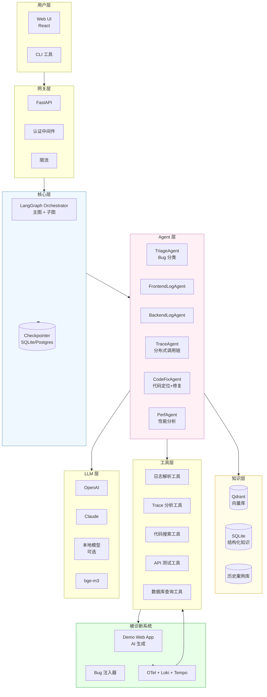
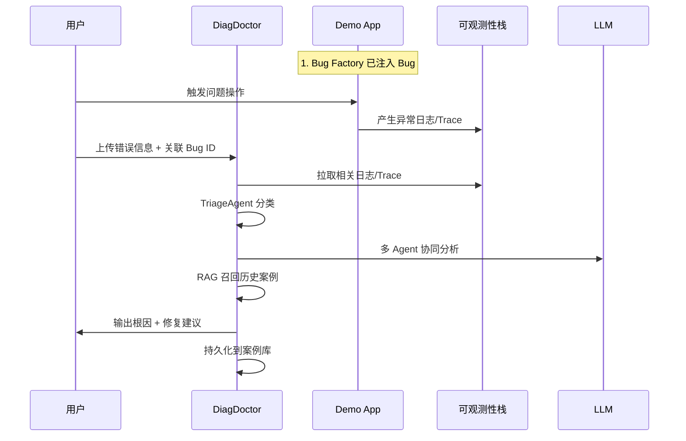
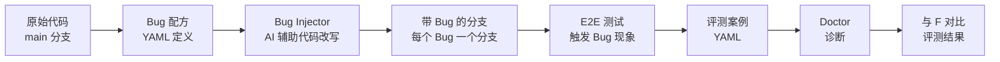
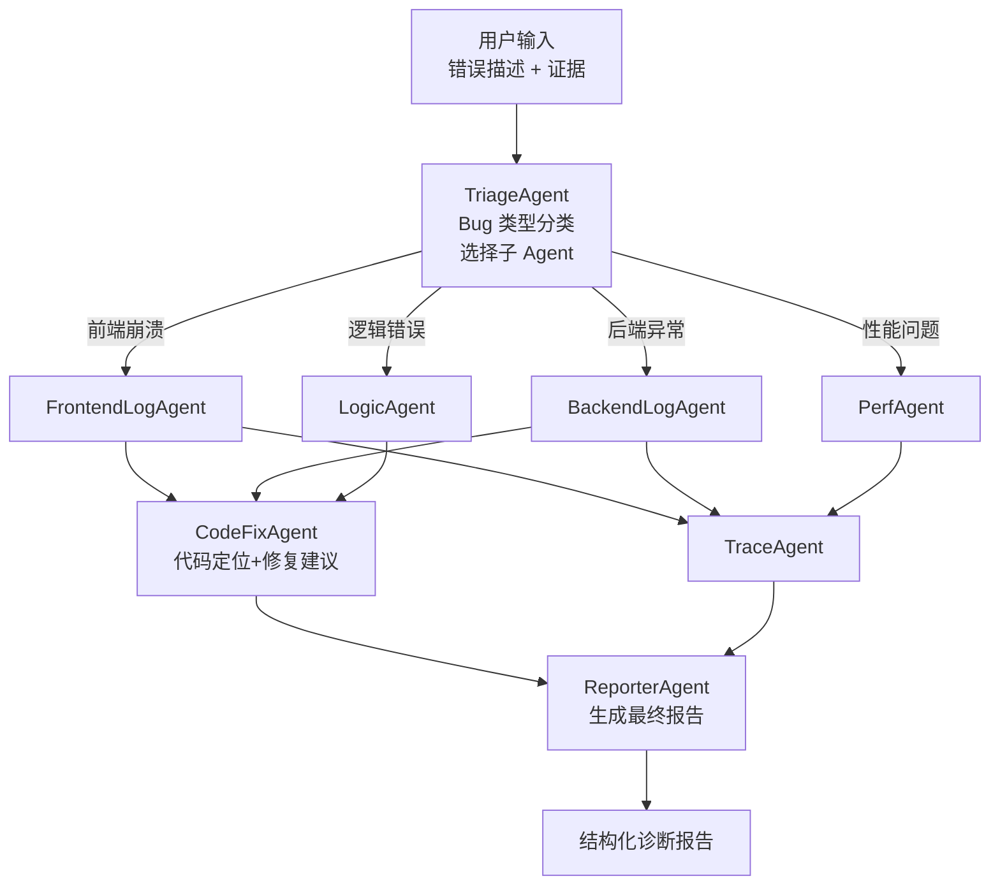
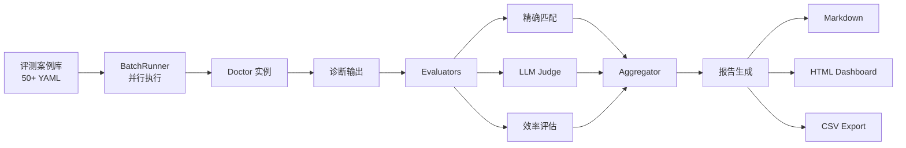
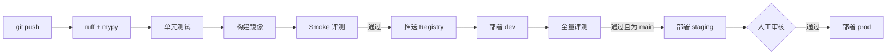
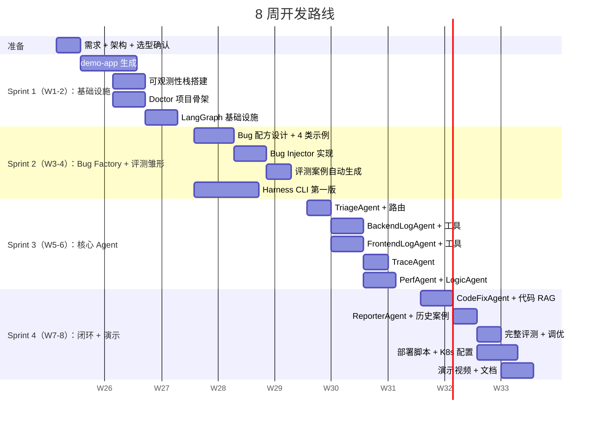

# Bug 诊断助手（DiagDoctor）从零构建方案

> 文档日期：2026-06-17  
> 工期：2 个月（约 8 周，借助 AI 工具）  
> 项目代号：**DiagDoctor**（暂定）  
> 文档定位：从零开始构建一个**完整、规范、可演示、有评测体系**的 AI Bug 诊断助手

---

## 目录

1. [项目定位与目标](#1-项目定位与目标)
2. [整体架构设计](#2-整体架构设计)
3. [目标系统选型（被诊断的应用）](#3-目标系统选型被诊断的应用)
4. [Bug 生成与注入系统](#4-bug-生成与注入系统)
5. [Agent 架构设计](#5-agent-架构设计)
6. [Harness 评测体系](#6-harness-评测体系)
7. [部署与运维](#7-部署与运维)
8. [8 周开发路线](#8-8-周开发路线)
9. [技术栈选型](#9-技术栈选型)
10. [AI 辅助开发策略](#10-ai-辅助开发策略)
11. [项目结构](#11-项目结构)
12. [风险与应对](#12-风险与应对)

---

## 1. 项目定位与目标

### 1.1 项目定位

**DiagDoctor** 是一个**通用 Web 应用 Bug 诊断助手**，核心能力：

> 给定一个出错的 Web 应用 + 错误现象描述 + 日志/Trace 数据，自动定位根因并给出修复建议。

### 1.2 区别于 DiagnosticAgent 的关键点

| 维度 | DiagnosticAgent（参考项目） | DiagDoctor（新项目） |
|------|--------------------------|--------------------|
| 目标系统 | 医疗影像 C++/.NET 桌面应用 | **AI 生成的 Web 应用**（轻量、可复现） |
| Bug 来源 | 真实生产 Bug（数据稀缺） | **AI 自动生成 + 注入**（数据可控、可量产） |
| 调试工具 | GDB/CDB（重型调试器） | 日志 + HTTP Trace + Source Map（轻量） |
| 知识库 | 业务领域专属 | **通用 + 可扩展**（先做通用，再支持领域插件） |
| 部署 | 内网，企业级 | **Docker Compose + K8s 双形态**，开源友好 |
| 技术栈 | AG2 + JSON 知识库 | **LangGraph + RAG**（直接用现代栈） |

### 1.3 终极目标（演示日要展示的）

| 演示场景 | 价值表述 |
|---------|---------|
| **场景 A：前端报错诊断** | 用户上传 Web 应用前端崩溃截图 + 控制台日志，Agent 自动定位代码行 + 修复建议 |
| **场景 B：后端 API 异常** | 用户给出 API 错误响应 + 请求日志，Agent 沿调用链自动追溯到根因 |
| **场景 C：性能瓶颈** | 用户报告"页面加载慢"，Agent 分析日志 + Trace 找出慢 SQL/慢接口 |
| **场景 D：数据不一致** | 用户报告"数据显示不对"，Agent 对照业务流程定位逻辑错误 |
| **能力展示** | 完整 Harness 评测集（50+ 案例）+ 评测报告 + 部署一键脚本 |

### 1.4 项目成功标准

- ✅ 至少 **4 类 Bug 类型**完整支持（前端崩溃、后端异常、性能、逻辑错误）
- ✅ 评测集 **≥ 50 个案例**，自动评测准确率 **≥ 75%**
- ✅ 一键 Docker 部署，新机器 **15 分钟内**跑起来
- ✅ 完整的 **README + 架构文档 + 演示视频**
- ✅ 代码符合工程规范（类型完整、测试覆盖 ≥ 60%、CI 通过）

---

## 2. 整体架构设计

### 2.1 系统总览



### 2.2 三个独立子系统

DiagDoctor 实际由 **3 个独立子项目**组成：

```
DiagDoctor/
├── demo-app/         # 子系统 A：被诊断的目标 Web 应用（AI 生成）
├── bug-factory/      # 子系统 B：Bug 生成与注入工厂
└── doctor/           # 子系统 C：诊断 Agent 主体
```

| 子系统 | 职责 | 工期占比 |
|--------|------|---------|
| **demo-app** | 被诊断的样本 Web 应用，AI 生成的 TODO/博客类应用 | 1 周 |
| **bug-factory** | 自动生成 Bug + 注入到 demo-app + 产生评测数据 | 1.5 周 |
| **doctor** | 诊断 Agent 主体（LangGraph + RAG + Harness） | 5 周 |
| 其他（部署、文档、演示） | — | 0.5 周 |

### 2.3 数据流



---

## 3. 目标系统选型（被诊断的应用）

### 3.1 选型原则

- ✅ **足够简单**：1 周内 AI 能生成完整版本
- ✅ **足够典型**：覆盖前端、后端、数据库、API 各层
- ✅ **足够丰富**：能注入多种类型的 Bug
- ✅ **可观测**：天然集成 OpenTelemetry
- ✅ **领域中立**：不绑定特定业务，方便演示

### 3.2 推荐方案：**TaskFlow**（任务管理类应用）

类似简化版 Trello/Todoist 的任务管理应用：

```
TaskFlow 功能模块：
├── 用户系统（注册/登录/JWT）
├── 项目管理（CRUD）
├── 任务管理（CRUD + 拖拽 + 截止时间）
├── 评论系统（任务下评论）
├── 文件附件上传
├── 标签系统
├── 数据统计图表
└── 通知系统
```

**为什么选 TaskFlow？**

| 优点 | 说明 |
|------|------|
| 业务逻辑清晰 | 大家都熟悉，不需要业务背景 |
| 涵盖技术栈广 | 前端 + 后端 + 数据库 + 文件存储 + WebSocket |
| Bug 模式典型 | 表单校验、权限、并发、缓存、N+1 查询等都能注入 |
| 演示效果好 | 可视化界面，bug 现象直观 |

### 3.3 技术栈（demo-app）

```
Frontend:
  - React 18 + TypeScript + Vite
  - Ant Design / shadcn/ui
  - Zustand 状态管理
  - TanStack Query
  - 集成 Sentry SDK（前端错误上报）

Backend:
  - Python FastAPI（与 Doctor 同栈，方便共享代码）
  - SQLAlchemy + Alembic
  - Pydantic
  - 集成 OpenTelemetry SDK

Database:
  - PostgreSQL（主数据）
  - Redis（缓存 + 会话）

Observability:
  - OpenTelemetry Collector
  - Loki（日志聚合）
  - Tempo（Trace 存储）
  - Grafana（统一查询）

Container:
  - Docker Compose（一键启动整套环境）
```

### 3.4 备选方案

| 方案 | 优点 | 缺点 |
|------|------|------|
| **TaskFlow（推荐）** | 业务清晰、技术栈广 | — |
| 简化版 e-commerce | 业务模式更复杂、Bug 类型多 | 工期可能超 |
| 博客系统 | 最简单 | Bug 类型偏少 |
| 在线问答 | 中等复杂度 | 与 LLM 应用重叠混淆 |

---

## 4. Bug 生成与注入系统

> 这是本项目**最有创新点**的部分，区别于参考项目"靠真实数据"的关键。

### 4.1 设计思路



### 4.2 Bug 类型矩阵

设计 **6 大类 × N 小类** 的 Bug 矩阵：

| 大类 | 小类示例 | 数量目标 |
|------|---------|---------|
| **前端崩溃** | 空指针访问、未捕获 Promise、组件渲染错误、状态错乱 | 8 |
| **后端异常** | 参数校验失效、SQL 注入、JWT 过期、依赖服务超时 | 10 |
| **性能问题** | N+1 查询、缺索引、缓存穿透、大对象阻塞主线程 | 8 |
| **逻辑错误** | 边界条件错误、并发竞态、权限越界、状态机错乱 | 8 |
| **数据问题** | 时区错误、字符编码、精度丢失、外键冲突 | 6 |
| **配置/环境** | 环境变量丢失、版本不兼容、CORS 配置错 | 4 |
| **合计** | | **44** |

> 加上变种和组合，最终评测集可达 **50-60 个案例**

### 4.3 Bug 配方格式（YAML）

```yaml
# bug-factory/recipes/be_001_n_plus_1.yaml
id: BE-001
title: "任务列表 N+1 查询"
category: backend_performance
severity: medium
expected_diagnosis:
  root_cause: "tasks/views.py 的 list_tasks 函数中，循环获取每个 task 的 comment_count，触发 N+1 查询"
  affected_file: "demo-app/backend/app/tasks/views.py"
  affected_line: 42
  fix_suggestion: "使用 SQLAlchemy joinedload 或 selectinload 预加载评论，或改为单次聚合查询"

injection:
  strategy: code_replace
  target_file: "demo-app/backend/app/tasks/views.py"
  # AI 用 prompt 改写代码以引入 bug
  ai_instruction: |
    把 list_tasks 函数中预加载评论的部分改回 N+1 模式：
    把 .options(joinedload(Task.comments)) 删除
    在循环里用 task.comments 而不是预加载结果

trigger:
  # 如何让 demo-app 暴露这个 bug
  type: e2e_action
  steps:
    - login_user: "demo@example.com"
    - create_tasks: 100
    - call_api: "GET /api/tasks?include_comments=true"
  expected_observation:
    - log_pattern: "SELECT \\* FROM comments WHERE task_id"
      occurrences: ">=100"
    - response_time_ms: ">2000"

evaluation:
  must_mention_keywords:
    - "N+1"
    - "joinedload"
    - "list_tasks"
  llm_judge_criteria: |
    诊断结果必须明确指出 N+1 查询问题，并建议使用 ORM 预加载或聚合查询。
```

### 4.4 Bug Factory 工作流

```python
# bug-factory/main.py 伪代码
class BugFactory:
    async def inject(self, recipe: BugRecipe) -> InjectedBug:
        # 1. 切出新分支
        branch = f"bug/{recipe.id}"
        await git_checkout(self.repo, branch, base="main")
        
        # 2. AI 辅助改写代码
        original = read_file(recipe.injection.target_file)
        modified = await self.ai.rewrite(
            original,
            instruction=recipe.injection.ai_instruction,
        )
        write_file(recipe.injection.target_file, modified)
        
        # 3. 提交
        await git_commit(branch, f"Inject bug: {recipe.id}")
        
        # 4. 启动 demo-app（该分支版本）
        container_id = await docker_start(branch)
        
        # 5. 触发 bug
        observation = await self.run_trigger(
            container_id, recipe.trigger
        )
        
        # 6. 收集证据
        evidence = await self.collect_evidence(container_id, recipe)
        
        # 7. 写入评测案例库
        await self.save_case(recipe, observation, evidence)
        
        return InjectedBug(...)
```

### 4.5 Bug 现象数据集

每个 Bug 注入后自动产生**评测案例**：

```yaml
# benchmark/cases/BE-001.yaml （由 Bug Factory 自动生成）
case_id: BE-001
recipe_id: BE-001
input:
  user_report: "项目任务列表加载很慢，越多任务越慢"
  evidence:
    logs:
      - source: "loki"
        query: "{app=\"taskflow-be\"} |= \"SELECT\" | tail 200"
        attached_file: "evidences/BE-001/logs.txt"
    traces:
      - source: "tempo"
        trace_id: "abc123"
        attached_file: "evidences/BE-001/trace.json"
    request:
      method: GET
      url: "/api/tasks?include_comments=true"
      response_time_ms: 4521
expected:
  category: backend_performance
  root_cause_summary: "N+1 查询问题"
  affected_file: "app/tasks/views.py"
  fix_keywords: ["joinedload", "selectinload", "N+1"]
```

---

## 5. Agent 架构设计

### 5.1 多 Agent 拓扑

采用 **Supervisor + Specialist** 模式：



### 5.2 各 Agent 职责

| Agent | 职责 | 主要工具 |
|-------|------|---------|
| **TriageAgent** | 根据错误描述+证据初步分类，决定调用哪些专业 Agent | RAG 检索历史相似案例 |
| **FrontendLogAgent** | 解析浏览器 Console / Sentry 日志 | source map 解析、stack trace 美化 |
| **BackendLogAgent** | 分析后端日志（Loki） | LogQL 查询、关键字过滤、时间窗筛选 |
| **TraceAgent** | 分析分布式 Trace（Tempo） | TraceQL 查询、调用链可视化、瓶颈定位 |
| **PerfAgent** | 性能问题分析 | SQL 慢查询、API 响应时间、资源使用 |
| **LogicAgent** | 业务逻辑问题分析 | 代码搜索、调用链追溯、状态对比 |
| **CodeFixAgent** | 代码定位 + 修复建议 | 代码 RAG、AST 分析、Diff 生成 |
| **ReporterAgent** | 综合各 Agent 输出生成最终报告 | 模板渲染 |

### 5.3 State Schema

```python
from typing import TypedDict, Annotated, Literal, Optional
from operator import add
from langgraph.graph.message import add_messages

class Evidence(TypedDict, total=False):
    user_report: str
    logs: list[LogEntry]
    traces: list[TraceData]
    error_screenshot: Optional[str]
    request_response: Optional[HttpInteraction]

class DiagnosisHypothesis(TypedDict):
    summary: str
    confidence: float  # 0-1
    affected_files: list[str]
    proposed_by: str  # which agent

class DoctorState(TypedDict):
    # 输入
    evidence: Evidence
    case_id: Optional[str]
    
    # Triage 结果
    bug_category: Literal[
        "frontend_crash", "backend_error",
        "performance", "logic", "data", "config"
    ]
    
    # 各 Agent 累积发现
    findings: Annotated[list[Finding], add]
    hypotheses: Annotated[list[DiagnosisHypothesis], add]
    
    # 最终报告
    report: Optional[DiagnosisReport]
    
    # 消息历史
    messages: Annotated[list, add_messages]
    
    # 元数据
    total_cost: Annotated[float, add]
    trace_id: str
```

### 5.4 LangGraph 主图

```python
def build_doctor_graph():
    g = StateGraph(DoctorState)
    
    # 节点
    g.add_node("triage", triage_node)
    g.add_node("frontend_log_agent", frontend_log_subgraph)
    g.add_node("backend_log_agent", backend_log_subgraph)
    g.add_node("perf_agent", perf_subgraph)
    g.add_node("logic_agent", logic_subgraph)
    g.add_node("trace_agent", trace_subgraph)
    g.add_node("code_fix_agent", code_fix_subgraph)
    g.add_node("reporter", reporter_node)
    g.add_node("case_store", case_store_node)  # 沉淀历史案例
    
    # 流程
    g.add_edge(START, "triage")
    g.add_conditional_edges("triage", route_by_category, {
        "frontend": "frontend_log_agent",
        "backend": "backend_log_agent",
        "performance": "perf_agent",
        "logic": "logic_agent",
    })
    
    # 各专业 Agent 完成后汇聚到 trace_agent（并行）
    g.add_edge("frontend_log_agent", "trace_agent")
    g.add_edge("backend_log_agent", "trace_agent")
    g.add_edge("perf_agent", "trace_agent")
    g.add_edge("logic_agent", "trace_agent")
    
    g.add_edge("trace_agent", "code_fix_agent")
    g.add_edge("code_fix_agent", "reporter")
    g.add_edge("reporter", "case_store")
    g.add_edge("case_store", END)
    
    return g.compile(checkpointer=SqliteSaver(...))
```

### 5.5 RAG 知识库设计

```
Knowledge Base:
├── 通用知识（精确匹配，结构化）
│   ├── HTTP 状态码语义
│   ├── 常见报错模式 → 类别映射
│   ├── 日志级别规范
│   └── 框架版本兼容矩阵
│
├── 领域知识（向量 RAG）
│   ├── 后端最佳实践（Python/FastAPI/SQLAlchemy）
│   ├── 前端最佳实践（React/TypeScript）
│   ├── 性能优化模式
│   └── 安全漏洞模式
│
├── 历史案例（向量 RAG）
│   └── 每次诊断结果自动入库
│
└── Demo App 上下文（向量 RAG）
    ├── 项目目录结构
    ├── API 接口定义
    ├── 数据库 schema
    └── 关键业务流程
```

---

## 6. Harness 评测体系

### 6.1 评测维度

```python
class EvaluationMetrics(BaseModel):
    # 准确性
    category_accuracy: float        # 分类准确率
    root_cause_match: float         # 根因匹配度（关键字 + LLM Judge）
    file_localization: float        # 文件定位准确率
    line_localization: Optional[float]  # 行定位准确率
    fix_quality: float              # 修复建议质量（LLM Judge）
    
    # 效率
    avg_tool_calls: int
    avg_token_cost: float
    avg_latency_seconds: float
    
    # 鲁棒性
    consistency: float  # 多次运行结果一致性
    
    # 综合得分
    overall: float
```

### 6.2 Harness 工作流



### 6.3 CLI 设计

```powershell
# 跑全量
uv run diagdoctor-bench run --suite all

# 跑某类
uv run diagdoctor-bench run --category backend_performance

# 单个案例
uv run diagdoctor-bench run --case BE-001

# 对比两个版本
uv run diagdoctor-bench compare `
    --baseline release/v1.0 `
    --candidate feature/new-prompt

# 持续观察（每次代码改动自动跑 smoke）
uv run diagdoctor-bench watch --suite smoke

# 生成报告
uv run diagdoctor-bench report --output html --since 7d
```

### 6.4 CI 集成

```yaml
# .github/workflows/eval.yml
name: Agent Evaluation

on:
  pull_request:
    paths:
      - "doctor/src/**"
      - "doctor/prompts/**"

jobs:
  smoke:
    runs-on: ubuntu-latest
    steps:
      - uses: actions/checkout@v4
      - name: Setup
        run: |
          docker compose up -d
          uv sync
      - name: Run smoke evaluation
        run: |
          diagdoctor-bench run --suite smoke --fail-threshold 0.7
      - name: Upload report
        uses: actions/upload-artifact@v4
        with:
          name: eval-report
          path: reports/
      - name: Comment on PR
        uses: actions/github-script@v7
        with:
          script: |
            // 把评测结果摘要贴到 PR 评论
```

---

## 7. 部署与运维

### 7.1 三种部署形态

| 形态 | 用途 | 复杂度 |
|------|------|-------|
| **Dev**：单机 Docker Compose | 本地开发 | 低 |
| **Demo**：单机 Compose + 生产配置 | 演示/小规模生产 | 中 |
| **Production**：K8s + Helm | 真正的生产 | 高 |

### 7.2 Docker Compose（Dev/Demo）

```yaml
# docker-compose.yml
version: '3.9'

services:
  # === 被诊断系统 ===
  demo-frontend:
    build: ./demo-app/frontend
    ports: ["3000:3000"]
  
  demo-backend:
    build: ./demo-app/backend
    environment:
      - OTEL_EXPORTER_OTLP_ENDPOINT=http://otel-collector:4317
    depends_on: [postgres, redis, otel-collector]
  
  postgres:
    image: postgres:16
    volumes: [postgres_data:/var/lib/postgresql/data]
  
  redis:
    image: redis:7
  
  # === 可观测性栈 ===
  otel-collector:
    image: otel/opentelemetry-collector
    config: ./infra/otel/collector.yaml
  
  loki:
    image: grafana/loki:2.9
    ports: ["3100:3100"]
  
  tempo:
    image: grafana/tempo:2.3
    ports: ["3200:3200"]
  
  grafana:
    image: grafana/grafana
    ports: ["3001:3000"]
  
  # === 诊断 Agent ===
  doctor-api:
    build: ./doctor
    environment:
      - LOKI_URL=http://loki:3100
      - TEMPO_URL=http://tempo:3200
      - VECTOR_DB_URL=http://qdrant:6333
    depends_on: [qdrant]
    ports: ["8000:8000"]
  
  doctor-ui:
    build: ./doctor/frontend
    ports: ["8080:80"]
  
  qdrant:
    image: qdrant/qdrant
    ports: ["6333:6333"]
    volumes: [qdrant_data:/qdrant/storage]

volumes:
  postgres_data:
  qdrant_data:
```

**一键启动：**
```powershell
make up   # 启动所有服务
make down # 停止
make logs # 查看日志
```

### 7.3 K8s 部署（生产形态）

```
infra/helm/
├── doctor/
│   ├── Chart.yaml
│   ├── values.yaml
│   └── templates/
│       ├── deployment.yaml
│       ├── service.yaml
│       ├── ingress.yaml
│       ├── hpa.yaml
│       └── configmap.yaml
└── kustomize/
    ├── base/
    └── overlays/
        ├── dev/
        ├── staging/
        └── production/
```

### 7.4 配置管理

```python
# doctor/src/config.py
from pydantic_settings import BaseSettings, SettingsConfigDict
from pydantic import SecretStr

class LLMConfig(BaseSettings):
    provider: Literal["openai", "anthropic", "local"] = "openai"
    api_key: SecretStr
    base_url: Optional[str] = None
    model: str = "gpt-4o-mini"

class ObservabilityConfig(BaseSettings):
    loki_url: str
    tempo_url: str
    prometheus_url: Optional[str] = None

class VectorDBConfig(BaseSettings):
    url: str
    collection_prefix: str = "diagdoctor"

class Settings(BaseSettings):
    env: Literal["dev", "staging", "prod"] = "dev"
    llm: LLMConfig
    primary_judge_llm: LLMConfig  # 评测用强模型
    observability: ObservabilityConfig
    vector_db: VectorDBConfig
    
    model_config = SettingsConfigDict(
        env_file=".env",
        env_nested_delimiter="__",
    )

settings = Settings()
```

### 7.5 CI/CD Pipeline



---

## 8. 8 周开发路线

### 8.1 总览



### 8.2 Sprint 1（W1-2）：基础设施

**目标：把"被诊断系统"和"诊断系统"两边的骨架都搭起来。**

#### W1：Demo App 生成
- [ ] 用 AI 生成 TaskFlow Web App（前端 + 后端 + 数据库）
- [ ] 集成 OpenTelemetry SDK（前后端都要）
- [ ] 编写 E2E 测试（Playwright）—— 后续用于触发 bug
- [ ] Docker Compose 编排所有服务

#### W2：Doctor 骨架 + 可观测性
- [ ] 启动可观测性栈（Loki/Tempo/Grafana）
- [ ] Doctor 项目骨架（FastAPI + 前端框架）
- [ ] 引入 LangGraph + Qdrant + 评测依赖
- [ ] 实现一个最小 Hello World Agent（通过 API 接收输入，输出固定响应）
- [ ] 前后端打通

**Sprint 1 验收：**
- TaskFlow 跑起来，能用浏览器访问，操作产生日志/Trace
- Doctor API 能接收请求，调用 LLM，返回响应
- 一键启动脚本（`make up`）

### 8.3 Sprint 2（W3-4）：Bug Factory + 评测雏形

**目标：能批量生成 Bug + 跑出第一份评测报告。**

#### W3：Bug Factory 核心
- [ ] 设计 Bug 配方 YAML 格式
- [ ] 编写 4 个示例配方（每大类至少 1 个）
- [ ] 实现 Bug Injector：AI 改写代码 + Git 分支管理
- [ ] 实现 Trigger Runner：自动触发 Bug 现象

#### W4：评测系统
- [ ] 实现评测案例自动生成（Bug 注入后自动产出 case YAML）
- [ ] 实现 Harness CLI（`run` / `report` 命令）
- [ ] 实现 3 个 Evaluator（exact_match / llm_judge / efficiency）
- [ ] 第一份评测报告（用最简单的 Doctor 跑 4 个 case）

**Sprint 2 验收：**
- 跑一行命令注入 Bug：`bug-factory inject BE-001`
- 跑一行命令评测：`diagdoctor-bench run --case BE-001`
- 能看到第一份 Markdown 评测报告

### 8.4 Sprint 3（W5-6）：核心 Agent

**目标：实现完整的多 Agent 架构，覆盖至少 4 类 Bug。**

#### W5：分类 + 日志 Agent
- [ ] TriageAgent（分类逻辑 + 路由条件边）
- [ ] BackendLogAgent + Loki 查询工具
- [ ] FrontendLogAgent + 浏览器日志解析工具
- [ ] 配方扩充到 20+

#### W6：Trace + 性能 + 逻辑
- [ ] TraceAgent + Tempo 查询工具
- [ ] PerfAgent + SQL 慢查询检测
- [ ] LogicAgent + 代码搜索
- [ ] 配方扩充到 40+

**Sprint 3 验收：**
- 4 类 Bug 都能跑通完整流程
- 评测集 ≥ 40 个 case
- 跑全量评测，准确率 ≥ 60%

### 8.5 Sprint 4（W7-8）：闭环 + 演示

**目标：补全代码定位能力 + 完成部署 + 演示物料。**

#### W7：代码定位 + 报告 + 历史案例
- [ ] CodeFixAgent + 代码向量化（用 tree-sitter 切片）
- [ ] ReporterAgent + 报告模板
- [ ] 历史案例自动入库
- [ ] 全量评测 + 调优（迭代 Prompt 直到准确率 ≥ 75%）

#### W8：部署 + 演示
- [ ] K8s Helm Chart
- [ ] CI/CD Pipeline
- [ ] 完整 README + 架构文档
- [ ] 演示视频（10-15 分钟）
- [ ] 技术分享 PPT

**Sprint 4 验收：**
- 评测集 ≥ 50 个 case，准确率 ≥ 75%
- 新机器从 0 部署到能用 ≤ 15 分钟
- 演示视频展示 4 类 Bug 完整诊断流程

---

## 9. 技术栈选型

### 9.1 完整技术栈

```yaml
Languages:
  - Python 3.11+         # Doctor + Demo Backend
  - TypeScript 5.x       # Doctor UI + Demo Frontend

Agent Framework:
  - LangGraph            # 主框架
  - langgraph-supervisor # 多 Agent 编排
  - langchain-mcp-adapters  # MCP 工具集成（可选）

LLM:
  - OpenAI / Anthropic  # 主推理
  - bge-m3              # Embedding
  - GPT-4 / Claude      # LLM Judge（评测）

Vector DB:
  - Qdrant              # 主选（性能好、过滤强）
  - Chroma              # 备选（嵌入式）

Backend:
  - FastAPI             # API 层
  - Pydantic v2         # 数据校验
  - SQLAlchemy 2.x      # ORM
  - Alembic             # 数据库迁移
  - structlog           # 结构化日志
  - tenacity            # 重试

Observability:
  - OpenTelemetry       # 标准遥测
  - Loki                # 日志聚合
  - Tempo               # Trace 存储
  - Grafana             # 可视化
  - LangSmith           # Agent Tracing（可选）

Frontend (Demo + Doctor UI):
  - React 18
  - TanStack Query
  - shadcn/ui + Tailwind
  - Zustand

Testing:
  - pytest + pytest-asyncio
  - Playwright          # E2E 测试 + Bug 触发
  - Vitest              # 前端测试

Deploy:
  - Docker / Compose
  - Kubernetes + Helm
  - GitHub Actions      # CI/CD

DevTools:
  - uv                  # Python 依赖管理（快）
  - ruff + mypy         # Lint + 类型检查
  - pre-commit
  - Just / Make         # 任务运行器
```

### 9.2 关键决策理由

| 决策 | 理由 |
|------|------|
| 选 Qdrant 不选 Chroma | 性能更好、Filter 能力强、生产级 |
| 选 Loki+Tempo 不选 ELK | 轻量、与 Grafana 一体、对 Agent 查询友好 |
| Demo Backend 也用 Python | 与 Doctor 同栈，方便共享代码（如数据模型） |
| 用 uv 不用 poetry | 速度提升 10-100 倍，对 AI 辅助迭代友好 |
| LangGraph 不用 AutoGen | 业界主流、原生 Checkpointer + HIL |

---

## 10. AI 辅助开发策略

### 10.1 各阶段 AI 应用

| 阶段 | AI 主要用法 | 节省工时 |
|------|-----------|---------|
| **Demo App 生成** | 直接 AI 生成项目骨架（v0.dev / Cursor） | -50% |
| **Bug 配方编写** | AI 提出常见 Bug 模式 + 改写代码 | -60% |
| **Agent Prompt 设计** | AI 迭代生成 Prompt，配合评测对比 | -40% |
| **测试用例生成** | AI 根据代码生成 pytest | -50% |
| **文档生成** | AI 写 docstring + README + 架构图 Mermaid | -70% |
| **数据标注** | AI 自动标注评测 case，人工 review | -50% |
| **代码评审** | AI 做 PR 评审、发现 bug | -30% |

### 10.2 AI 不能替代的事

- ❌ 架构决策（必须人决定）
- ❌ Bug 配方的"业务合理性"判断
- ❌ 评测结果的最终判断
- ❌ 安全相关代码逐行 review
- ❌ 演示叙事的设计

### 10.3 推荐 AI 工具栈

| 工具 | 用途 |
|------|------|
| **Cursor / Copilot** | 日常代码生成 |
| **Claude / GPT-4** | 架构讨论、复杂逻辑设计 |
| **v0.dev** | 前端组件快速生成 |
| **Aider** | 命令行 AI 辅助 |
| **GitHub Copilot Workspace** | 多文件协同改动 |

---

## 11. 项目结构

```
DiagDoctor/
├── README.md                      # 项目主文档
├── docs/
│   ├── architecture.md            # 架构总览
│   ├── development.md             # 开发指南
│   ├── deployment.md              # 部署指南
│   ├── bug-recipe-guide.md        # Bug 配方编写指南
│   └── eval-reports/              # 评测报告
├── demo-app/                      # 子系统 A
│   ├── frontend/
│   ├── backend/
│   └── docker-compose.yml
├── bug-factory/                   # 子系统 B
│   ├── recipes/                   # Bug 配方 YAML
│   ├── src/
│   │   ├── injector.py
│   │   ├── trigger.py
│   │   ├── evidence_collector.py
│   │   └── case_generator.py
│   └── tests/
├── doctor/                        # 子系统 C（核心）
│   ├── src/
│   │   ├── api/                   # FastAPI 路由
│   │   ├── graph/                 # LangGraph 实现
│   │   │   ├── state.py
│   │   │   ├── main_graph.py
│   │   │   ├── subgraphs/
│   │   │   └── nodes/
│   │   ├── agents/                # Agent 配置
│   │   ├── tools/                 # 工具实现
│   │   ├── knowledge/             # 知识库
│   │   ├── prompts/               # Prompt 模板（Jinja2）
│   │   ├── observability/         # 日志/Cost/Tracing
│   │   ├── security/              # 安全工具
│   │   └── config.py
│   ├── frontend/                  # Doctor 自己的 UI
│   ├── tests/
│   └── pyproject.toml
├── benchmark/                     # 评测系统
│   ├── cases/                     # 评测案例
│   ├── src/
│   │   ├── runner.py
│   │   ├── evaluators/
│   │   ├── reporters/
│   │   └── cli.py
│   └── reports/                   # 历史报告
├── infra/                         # 部署配置
│   ├── docker-compose.yml
│   ├── otel/
│   ├── helm/
│   └── kustomize/
├── scripts/                       # 辅助脚本
│   ├── setup.sh
│   ├── inject-all-bugs.sh
│   └── generate-eval-cases.sh
├── .github/workflows/             # CI/CD
├── Makefile / justfile
└── pyproject.toml                 # workspace 根
```

---

## 12. 风险与应对

### 12.1 主要风险

| 风险 | 概率 | 影响 | 应对 |
|------|------|------|------|
| Demo App 复杂度失控 | 中 | 高 | 严格控制功能范围，砍刀准备好 |
| Bug 注入产生的现象不真实 | 中 | 中 | 每个配方人工 review，必要时调整 |
| 评测案例标注主观性 | 高 | 中 | 用 LLM Judge + 人工抽检结合 |
| 多 Agent 协同 Token 消耗大 | 中 | 中 | LLM 缓存 + 早停 + Prompt 压缩 |
| Token 成本超预算 | 高 | 中 | 评测用本地小模型 + 只对最终用强模型 |
| 工期超 | 高 | 高 | 8 周计划留 1 周 buffer 在 Sprint 4 |

### 12.2 砍刀清单（按优先级）

如果时间不够，按以下顺序砍：

1. 最先砍：K8s Helm Chart（保留 Docker Compose 即可）
2. 砍：CodeFixAgent 的代码修改建议（只做定位，不做修改）
3. 砍：Demo App 的某些次要功能（如附件、通知）
4. 砍：LogicAgent（保留 4 类 Bug 中 3 类即可演示）
5. 砍：完整的 RAG 历史案例闭环（演示用 mock）
6. 砍：Doctor UI（用 Postman/curl 演示后端能力）

**绝对不能砍的：**
- ✅ Demo App + Bug Factory（项目灵魂）
- ✅ TriageAgent + 至少 2 类专业 Agent
- ✅ Harness 评测体系
- ✅ Docker Compose 一键启动
- ✅ 演示视频

---

## 附录 A：Bug 配方示例集（供 Sprint 2 起步）

### 前端崩溃类
- FE-001：组件接收 null props 导致 TypeError
- FE-002：未捕获的 Promise rejection 让整个页面白屏
- FE-003：状态更新在 unmounted 组件上的 warning

### 后端异常类
- BE-001：N+1 查询导致接口慢
- BE-002：Pydantic 校验绕过（Request body 类型不严）
- BE-003：JWT 过期处理缺失
- BE-004：File upload 缺乏大小限制

### 性能问题类
- PERF-001：缺少数据库索引
- PERF-002：缓存穿透（key 命中率低）
- PERF-003：循环内调用外部 API

### 逻辑错误类
- LOGIC-001：权限检查越界（A 用户能看 B 用户数据）
- LOGIC-002：并发竞态（双击下单导致重复订单）
- LOGIC-003：时区错误（任务截止时间显示不对）

---

## 附录 B：演示日 PPT 大纲

| 页 | 内容 |
|---|------|
| 1 | 标题：DiagDoctor —— 用 AI 诊断 AI 写的 Bug |
| 2 | 项目动机：为什么需要这个 |
| 3 | 整体架构图（三个子系统） |
| 4 | 核心创新：自动化 Bug 注入流水线 |
| 5 | 多 Agent 协同诊断流程 |
| 6-9 | 4 类 Bug 现场演示（每页 1 类） |
| 10 | Harness 评测：50+ 案例的数据汇总 |
| 11 | 部署演示：从 0 到运行 < 15 分钟 |
| 12 | 技术亮点总结 |
| 13 | 与 DiagnosticAgent 对比表 |
| 14 | 后续路线 |
| 15 | 个人收获 + Q&A |

---

## 附录 C：与 DiagnosticAgent 项目的差异化定位

| 维度 | DiagnosticAgent | DiagDoctor |
|------|--------------|-----------|
| 目标 | 解决真实业务 Bug | **构建技术能力 + 演示价值** |
| 数据 | 真实 Bug，稀缺 | **AI 自动生成，可量产** |
| 复杂度 | 业务复杂、调试工具重 | **轻量、可复现** |
| 闭环 | 半人工 | **完全自动化（生成→注入→诊断→评测）** |
| 框架 | AG2（老） | **LangGraph（新）** |
| 知识库 | JSON 精确匹配 | **向量 RAG** |
| 部署 | 内网企业 | **Docker / K8s 双形态** |
| 演示 | 业务流程 | **技术能力闭环展示** |

DiagDoctor 是一个**自给自足的技术演示项目**：
- 自己生成被诊断系统
- 自己生成 Bug
- 自己诊断自己生成的 Bug
- 自己评测自己的诊断质量
- 形成完美技术闭环

---

## 最后一句话

> **不是要做一个完美的产品，而是要做一个能讲清楚、能演示、能复用、能学习的"技术作品"。**
>
> 8 周时间，AI 辅助下，目标是产出：
> - 一个能 5 分钟跑起来的项目
> - 一份完整的评测报告
> - 一段令人印象深刻的演示视频
> - 一份能讲明白整个系统设计的技术分享

这才是 1 个工程师在 AI 时代应该展现的能力。
