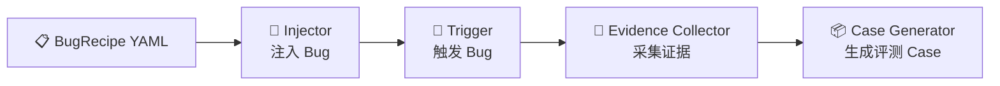

# Bug Factory 全面总结

> 生成日期：2026-07-08

---

## 一、Bug 设计理念

Bug Factory 的核心设计遵循 **"高质量可诊断 Bug" 五条标准**（S1-S5），每个 bug 配方都是一份**自包含、确定性、可评测**的完整规格书：

| 标准 | 含义 | 保证方式 |
|------|------|----------|
| **S1 注入确定性** | 注入后代码改动完全可预期 | 优先使用精确 `diff_patch`（统一 diff 格式），AI 改写仅作兜底 |
| **S2 可触发性** | 存在确定的请求序列稳定触发 bug | 每个 recipe 内嵌完整 trigger 步骤（登录→造数据→发请求） |
| **S3 可观测性** | 触发后必然在日志/trace 中留下信号 | `expected_observation` 定义 log 正则 + trace 属性，由 evidence collector 验证 |
| **S4 信号-期望对齐** | 期望信号是真实可观测的 | log_pattern 必须基于真实运行验证，禁止凭空想象 |
| **S5 根因唯一可判** | 根因明确、单一 | 每个 recipe 的 `expected_diagnosis` 精确到文件+行号+修复建议 |

每个 `BugRecipe`（Pydantic v2 模型）由 **6 大模块** 组成：

```
BugRecipe
├── expected_diagnosis   # 标准答案：根因 + 受影响文件/行号 + 修复建议 + 关键词
├── injection            # 如何注入：策略 + 目标文件 + AI指令/diff_patch
├── trigger              # 如何触发：步骤序列 + 期望观测 + 证据分层
├── evaluation           # 如何评测：必须/建议关键词 + LLM judge 标准 + 置信度
├── tags                 # 自由标签（含 difficulty:L1-L4）
└── categories           # 多标签真值分类
```

**核心设计原则**：

- **分离关注点**：Injection 只管"造 bug"，Trigger 只管"激活 bug"，Evidence 只管"收集证据"，三者解耦
- **自包含**：每个 recipe 的 trigger 自己登录、自己造数据、自己发请求，不依赖外部预置状态
- **难度梯度**：L1（N+1 单改一行）→ L4（跨层级联 + 混淆因子），确保能区分 Doctor 能力

---

## 二、Bug Factory 完整自动化流水线

`bug-factory` CLI 提供 `full` 命令一键跑通 **4 阶段流水线**：



### 阶段 1：Bug Injection（`BugInjector`）

| 步骤 | 工具 | 说明 |
|------|------|------|
| 1. 创建分支 | `GitManager` | 从 `main` 切出 `bug/{recipe_id}` 分支 |
| 2. 代码修改 | `AIRewriter` 或 `DiffPatchApplier` | 优先精确 diff patch；兜底用 LLM 按 `ai_instruction` 改写 |
| 3. 变更验证 | 注入后 diff 对比 | 确保文件确实被修改（否则抛 `InjectionError`） |
| 4. 提交 | `GitManager` | 提交到 bug 分支，记录 unified diff |

**5 种注入策略**：`code_replace`（替换代码） / `code_insert`（插入代码） / `code_delete` / `config_change` / `env_change`

### 阶段 2：Bug Trigger（`TriggerRunner`）

| 步骤类型 | 说明 |
|----------|------|
| `login` | 登录获取 JWT token，缓存到 session |
| `create_data` | 通过 REST API 创建 project/task/comment（支持 `repeat: N` 批量） |
| `api_call` | 任意 HTTP 请求，自动注入 Bearer token |
| `api_call_concurrent` | 并发 API 调用（用于竞态条件 bug） |
| `ui_navigate` | Playwright 浏览器导航到页面 |
| `ui_click` | 浏览器点击交互 |
| `wait` | 等待日志刷新到 Loki（默认 8s） |
| `collect_diff` | 自检：对比 API 实际响应与期望，验证 bug 已激活 |

支持模板变量 `{project_id}`、`{task_id}` 在步骤间传递。

### 阶段 3：Evidence Collection（`EvidenceCollector`）

并行从 Loki + Tempo 拉取时间窗口内的：

- **Loki 日志**：按 `demo-backend`、`demo-frontend` 服务过滤
- **Tempo traces**：span 级别的调用链数据
- **浏览器错误**：`window.onerror` 上报的 `client_error` span

**智能裁剪**：根据 `expected_evidence` 配置，纯后端 bug 跳过 trace 拉取，纯前端 bug 跳过浏览器错误扫描。

### 阶段 4：Case Generation（`CaseGenerator`）

将前 3 阶段产物组装为 `EvaluationCase`：

- **用户报告**：LLM 将技术标题转为自然语言（"我打开看板结果白屏了..."）
- **触发摘要**：步骤执行时间线
- **证据文件**：logs.json / traces.json / browser_errors.json
- **跨层标记**：自动识别前端症状+后端根因的 cross-layer case
- **affected_line**：从 git diff 自动提取

最终输出到 `bug-factory/output/{recipe_id}/`。

---

## 三、15 个 Bug Case 覆盖全景

按 **8 大类别** 组织，覆盖 **4 个难度等级 (L1-L4)**：

### 🔴 后端错误（Backend Error）— 3 个

| ID | 标题 | 根因 | 难度 |
|----|------|------|------|
| **BE-020** | 发评论偶发 500 | `create_comment` 删除了任务存在性检查，对不存在的 task_id 插入触发外键约束违反 (IntegrityError) | L1 |
| **BE-021** | 打开任务详情 500 | `get_task` 把 `scalar_one_or_none()` 改成 `scalar_one()`，任务不存在抛 `NoResultFound` 而非 404 | L2 |
| **BE-022** | 部分任务随机 500 | `get_task` 新增 `task.assignee_id.hex` 解引用，未分配负责人时 `assignee_id=None` 抛 `AttributeError` | L3 🔴红鲱鱼 |

### 🟡 前端崩溃（Frontend Crash）— 2 个

| ID | 标题 | 根因 | 难度 |
|----|------|------|------|
| **FE-020** | 看板整页白屏 | `SortableTaskCard` 渲染 `task.tags.length`，但列表接口不返回 `tags` 字段 → `undefined` → TypeError。**跨层 bug**：症状在前端，根因在后端 TaskResponse schema 缺字段 | L4 🔴跨层 |
| **FE-021** | 部分详情页白屏 | 详情页渲染 `task.assignee_id.slice(0,8)`，未分配负责人时 `assignee_id=null` → TypeError | L2 🔴红鲱鱼 |

### 🟣 业务逻辑错误（Logic）— 3 个

| ID | 标题 | 根因 | 难度 |
|----|------|------|------|
| **LOGIC-020** | 越权查看他人项目详情 | `get_project` 删除了 `owner_id == current_user.id` 过滤 → IDOR 越权读取 | L2 |
| **LOGIC-021** | 项目列表混入他人项目 | `list_projects` 删除 `owner_id` 过滤 → 全表返回 → 横向越权数据泄露 | L3 🔴红鲱鱼 |
| **LOGIC-022** | 改状态不生效 | `update_task` 用 `update_data.pop('status', None)` 静默丢弃 status 字段 | L2 |

### 🟠 性能（Performance）— 2 个（+1 级联）

| ID | 标题 | 根因 | 难度 |
|----|------|------|------|
| **PERF-020** | 看板越来越慢 | `list_tasks` 删除 `selectinload(Task.comments)`，改为对每个 task 逐条查 comments → N+1 | L1 |
| **PERF-021** | 项目列表页变慢 | `list_projects` 对每个 project 逐条查 tasks → N+1 | L2 |

### 🔵 级联故障（Cascade）— 1 个

| ID | 标题 | 根因 | 难度 |
|----|------|------|------|
| **CASCADE-020** | 刷新几次后超时打不开 | N+1（PERF-021）+ `asyncio.sleep(20)` + 前端超时 5s + 自动重试×3 → 重试风暴 → 后端负载放大 4 倍 → 级联崩溃。**跨层 + 多因子** | L4 🔴跨层 |

### 🟢 配置错误（Config）— 1 个

| ID | 标题 | 根因 | 难度 |
|----|------|------|------|
| **CONFIG-020** | 登录即掉线 | `jwt_expire_minutes=0`（误以为 0=永不过期），实际签发即过期 → 所有请求 401 | L3 🔴误导性默认值 |

### ⚪ 数据错误（Data）— 2 个

| ID | 标题 | 根因 | 难度 |
|----|------|------|------|
| **DATA-020** | 任务顺序反了 | `list_tasks` 排序从 `desc()` 改成 `asc()` | L2 |
| **DATA-021** | 截止日期没保存 | `create_task` 把 `due_date=payload.due_date` 改成 `due_date=None` → 静默数据丢失 | L2 |

### 🔶 竞态条件（Race）— 1 个

| ID | 标题 | 根因 | 难度 |
|----|------|------|------|
| **RACE-020** | 并发编辑丢数据 | `update_task` 改为 raw SQL 全量写回 + 0.3s sleep，B 的旧快照覆盖 A 的修改 → lost update | L4 |

---

## 四、覆盖维度总览

```
                    前端    后端    数据层   配置
                    症状    根因
FE-020 跨层          ●      ●
FE-021 红鲱鱼        ●
BE-020 FK 违反               ●
BE-021 异常处理               ●
BE-022 红鲱鱼                ●
LOGIC-020 IDOR               ●
LOGIC-021 数据泄露             ●
LOGIC-022 静默丢弃             ●
PERF-020 N+1                 ●
PERF-021 N+1                 ●
CASCADE-020 级联      ●      ●       ●
CONFIG-020 配置                        ●
DATA-020 排序                  ●
DATA-021 数据丢失               ●      ●
RACE-020 竞态                 ●
```

### 覆盖的技术模式

- **SQLAlchemy 反模式**：外键违反、`scalar_one` vs `scalar_one_or_none`、N+1 查询、排序错误
- **安全漏洞**：IDOR 越权（读+列表）、数据泄露
- **前端崩溃**：`undefined`/`null` 属性访问、API 契约 mismatch
- **并发问题**：lost update / read-then-write
- **配置陷阱**：JWT 过期时间误导性默认值
- **观测性挑战**：红鲱鱼（部分触发）、跨层（症状≠根因）、级联（多因子）、静默丢弃（无异常）

### 难度梯度设计

- **L1 (2个)**：单点修改，日志直接暴露根因（BE-020, PERF-020）
- **L2 (7个)**：需理解上下文，但根因单一（BE-021, FE-021, LOGIC-020/022, DATA-020/021, PERF-021）
- **L3 (3个)**：含红鲱鱼/误导因子，需排除干扰（BE-022, LOGIC-021, CONFIG-020）
- **L4 (3个)**：跨层诊断 + 多因子组合（FE-020, CASCADE-020, RACE-020）

---

这 15 个 case 共同构成了一套能评测 Doctor Agent **从简单代码错误到复杂跨层级联故障**全频谱诊断能力的基准集。
