# DiagDoctor 诊断对��端（完整版）�施计�

> 本文档是��端�套�施的�步跟进清�。��Phase 都列出了**目标 / 涉�文件 / 具体步骤 / 验收标准**，�独立完�并验收��进入下一阶段�
>
> **产�形�*：��用户的**诊断对�应用**——用户输�bug 内容（user_report + �选日�trace/�览器错误），通过对��界�观看诊断过程（���� + 工具调用 + 审批），最终拿到结�化诊断报告�*�是开�者用的�观测性�制�**�
>
> 时点：本计划基� V4（`create_agent` + 5 middleware）�端�状制定。�端调研结论�文末「附�A：�端�状速查��

---

## 0. 总览

### 0.1 目标功能� 项）

| # | 功能 | 价�| �地 Phase |
|---|------|------|-----------|
| 1 | ��诊断对�（LLM token + 工具调用内�渲染�| 核心 | P1 |
| 2 | 工具调用 generative UI �片（展开�args/result/latency/dedup�| 差异�| P1 |
| 3 | �时预算 / Token / Cost 侧边�� | 生产�识 | P1 + P4 |
| 4 | HITL 工具审批 + 方�注入（useInterrupt�| 高价�| P3 |
| 5 | ��链�视化（golden_signals �correlations �findings �report�| �端价值显性化 | P2 |
| 6 | 评测��� 维分�+ run 对比�| 评测闭� | P5 |
| 7 | �馈��标注（纠��Langfuse score + 本地集） | 评测�轮 | P6 |
| 8 | �Case 管� + Langfuse trace 跳转 | �观测�| P5 + P7 |

### 0.2 技术栈（已选路�B：CopilotKit�

- **�端核心**：React 19 + Vite + TypeScript + Tailwind + **CopilotKit**（`@copilotkit/react-core` + `@copilotkit/react-ui`�
- **诊断交互�*：CopilotKit 预组件（`CopilotChat` / `CopilotSidebar`）—�自带���工具调用渲染�generative UI�HITL，slot 系统��层替�样�/�组�
- **结�化侧��**（自建，�`useCoAgent` 订阅�LangGraph state）：BudgetDashboard�EvidenceChainGraph�ReportPanel
- **状�*：CopilotKit `useCoAgent`（agent state �步，替代自建事件总线� TanStack Query（评��馈 REST� Zustand（仅本地 UI �）
- **�视�*：reactflow（��链图）�recharts（评测雷达图�
- **�端**：FastAPI + **CopilotKit FastAPI runtime**（暴�LangGraph agent，替代手�SSE 事件总线� `CopilotKitMiddleware()`（drop 进��`create_agent` middleware 列表� LangGraph `interrupt()`/`Command(resume=)`（HITL�

> **关键转�**：�计划自建 asyncio.Queue 事件总线 + 手写 SSE drain（P1）和自建 interrupt/resume 端点（P3）的两大�活，改�CopilotKit �AG-UI runtime + `useInterrupt` �管。代价是诊断交互形��「�制���为「chat + 侧边����

### 0.3 目录约定

- �端：`doctor/frontend/`（� doctor 包�级，CORS 已放�5173�
- �端：`doctor/be/src/main.py` 挂载 CopilotKit runtime；`doctor/be/src/graph/subgraphs/diagnosis_agent.py` 追加 `CopilotKitMiddleware()`；新�`doctor/be/src/graph/nodes/diagnosis_agent/middleware/hitl_approval.py`�`doctor/be/src/observability/pricing.py`�`doctor/be/src/api/{cases,runs,feedback}.py`

### 0.4 ���数��

```mermaid
flowchart LR
    subgraph FE["doctor/frontend (Vite 5173)"]
        Chat["CopilotChat/Sidebar (��+工具+HITL 预组�"]
        Side["侧边��(自建, �useCoAgent)"]
        HITL["useInterrupt 渲染审批"]
        REST["TanStack Query REST"]
    end
    subgraph BE["doctor/src (FastAPI 8001)"]
        CKR["CopilotKit Runtime /api/copilotkit"]
        Graph["LangGraph ingest-diagnosis_agent-reporter"]
        CKMW["CopilotKitMiddleware() dropè¿?create_agent"]
        MW["�有 5 middlewares"]
        Cost["TokenAccountant �线"]
        CKPT["SqliteSaver"]
    end
    subgraph LF["Langfuse :3002"]
        Trace["trace/observation"]
        Scores["scores/dataset"]
    end

    Chat -->|AG-UI �议| CKR
    CKR --> Graph
    Graph -->|内层 create_agent| CKMW
    CKMW --> MW
    Side -->|useCoAgent 订阅 state| CKR
    HITL -->|interrupt 渲染/resolve| CKR
    Graph -->|interrupt 暂�| CKR
    REST -->|GET cases/runs/scores POST feedback| CKR
    CKR -->|fetch scores/traces| LF
    MW -->|record spans/scores| Trace
```



> ��计划对比：SSE 事件总线消失，改�CopilotKit AG-UI runtime 统一承载��/工具/HITL；预算���链数�通过 `useCoAgent` 订阅 LangGraph state ��，��需�middleware 往 queue put 事件�

---

## Phase 0：脚手��基础设施

### 目标
�好�端工程骨���端类�契约基础，跑通空白页 + �康检查�通�

### 涉�文件
- 新建：`doctor/frontend/`（整�Vite 工程�
- 修改：`doctor/be/pyproject.toml`（加 `copilotkit` �赖）�`doctor/be/src/main.py`（挂�CopilotKit runtime）�`doctor/be/src/graph/subgraphs/diagnosis_agent.py`（middleware 列表�`CopilotKitMiddleware()`�

### 具体步骤
1. `npm create vite@latest doctor/frontend -- --template react-ts`
2. 安装�端�赖：`@copilotkit/react-core`�`@copilotkit/react-ui`�`react-router-dom`�`@tanstack/react-query`�`reactflow`�`recharts`�`tailwindcss`�shadcn/ui（按官方 init）�`lucide-react`�`zustand`
3. �置 Tailwind + shadcn/ui，建�`src/components/ui/`
4. 目录结�：`src/api/`（REST client + types）�`src/features/{diagnosis,eval}/`�`src/pages/`�`src/main.tsx`�`src/App.tsx`
5. 路由：`/` �DiagnosePage（诊断对�）�`/eval` �EvalPage�`/cases/:id` �CasePage�`/runs/:name` �RunPage（��组件）
6. �端：`uv add copilotkit`；在 `main.py` �CopilotKit �FastAPI 集�挂载 `/api/copilotkit` runtime，注�diagnosis agent（暴露编译��LangGraph 图）
7. �端：`subgraphs/diagnosis_agent.py` �`create_agent(middleware=[...])` 列表**末尾追加** `CopilotKitMiddleware()`（�动��5 �middleware 顺�，CopilotKit 的转�逻辑放在最内层���
8. `src/api/client.ts`：fetch �装（baseURL `http://localhost:8001`），用�评测/�馈 REST
9. `src/api/types.ts`：手�TS 类�对应�端 Pydantic（`DiagnosisReport`�`BudgetState`�`Finding`�`NormalizedEvidence`�`Signal`�`Correlation`�`TimelineEvent`�`Evidence`�
10. 顶层 `CopilotKit` Provider 包裹（`runtimeUrl="/api/copilotkit"` + `agent="diagnosis"`），导航�+ 暗色主题
11. **Spike 验�**：在 DiagnosePage 放一个最�`CopilotChat`，�一�"test"，确认能�到�端 agent 并收到���包（验� CopilotKitMiddleware + runtime + 多节点图打通）

### 验收标准
- �端�5173� 路由�切；`CopilotKit` Provider 就�
- �端 `/api/copilotkit` �用；最�`CopilotChat` 能� diagnosis agent ��对�（��agent 还没���输入也算打通）
- spike 确认：外�3 节点图（ingest→diagnosis_agent→reporter）能�被 CopilotKit 当作一�agent 暴露。若�能，记录�点，Phase 1 先解�

---

## Phase 1：��诊断对�（最关键，端到端跑通）

### 目标
用户�`CopilotChat` 输入 bug 内容，看到����+ 工具调用 generative UI �片 + 侧边预算���时更新。CopilotKit 承载��/工具/HITL�*��自建 SSE 事件总线**�

### 涉�文件
- �端�
  - `doctor/be/src/graph/subgraphs/diagnosis_agent.py`（确�`CopilotKitMiddleware()` 已加�
  - `doctor/be/src/graph/state.py`（确�`budget`/`evidence`/`findings`/`report` �DoctorState 中��CopilotKit state �步�
  - `doctor/be/src/graph/nodes/diagnosis_agent/middleware/budget_guard.py`（确�`ctx_budget` 写� DoctorState.budget 的路径，�useCoAgent 订阅�
  - `doctor/be/src/graph/nodes/diagnosis_agent/node.py`（确�中�state ����——�下方「state ��性�说�）
- �端�
  - `src/pages/DiagnosePage.tsx`（布局：左 CopilotChat + �侧边��）
  - `src/features/diagnosis/CaseInputChat.tsx`（包 `CopilotChat`，��labels/welcomeMessage�
  - `src/features/diagnosis/ToolCallCard.tsx`（generative UI：用 `useRenderToolCall` 渲染工具调用�片�
  - `src/features/diagnosis/BudgetPanel.tsx`（侧边��，�`useCoAgent` state.budget�
  - `src/features/diagnosis/ReportPanel.tsx`（最�版，读 state.report，完整版�P2�

### 关键机制说�

**���工具调�*：CopilotKit �`CopilotChat` �AG-UI �议自动�收 LLM token �和工具调用事件，无需手写 SSE。工具调用用 `useRenderToolCall(({ name, args, result, status }) => ...)` 注册自定义�片渲染，显示工具�args（�展开�result/latency/dedup 跳过标记�

**预算/���时数�**：用 `useCoAgent` 订阅 LangGraph state。`const { state } = useCoAgent({ name: "diagnosis" })`，`state.budget` / `state.evidence` / `state.findings` �化时组件自动�渲染�

**state ��性注�*：LangGraph state 默认�在节点边界更新。`budget_guard` �`ctx_budget` �middleware 内�时�但写�ContextVar，�会自动�步到�端。两�路�
- **方案 1（��）**：在 `budget_guard.abefore_model` �`ctx_budget.to_dict()` 写入 DoctorState 的一个��reducer 字段（如 `budget_tick`），�CopilotKit state �步能�到��
- **方案 2**：��BudgetPanel 改用轮询/�级�在节点结�更新（粒度粗，����
先�方案 1 �spike，确�CopilotKit 能���高�state ��；若�行，�退方案 2 并在 P4 �Langfuse polling 补足�时性�

### 具体步骤
1. **�端**：在 `DoctorState` 加一�`budget_ticks: Annotated[list, add]`（或类似��字段），`budget_guard.abefore_model` �轮 append 当� `ctx_budget.to_dict()`，使中间预算�被 CopilotKit �步
2. **�端**：确�`evidence`（ingest �）�`findings`�`report` 已在 DoctorState（已存在），CopilotKit state �步�直�用
3. **�端 DiagnosePage**：左 60% �`CopilotChat`（welcomeMessage 引导用户�述 bug + 粘贴日志/trace），�40% �BudgetPanel
4. **�端 CaseInputChat**：��`labels`�`suggestions`（如「试试一�backend 500 case�）
5. **�端 ToolCallCard**：`useRenderToolCall` 注册全局工具渲染，覆盖所有诊断工具（search_observability/code_search/db_query 等），�片�展开/折��latency�dedup �显
6. **�端 BudgetPanel**：`useCoAgent` �`state.budget_ticks` 最新一�+ `state.budget`，渲�iteration/12�tool_calls�total_used/100k�usage_ratio�phase�elapsed�early_stopped 高亮
7. **�调**：�起一�smoke case，确认�天��+ 工具�片 + 预算�都�时

### 验收标准
- 用户�CopilotChat 输入 bug �述，看到����文�
- �次工具调用出��展开�片，dedup 调用�显「跳过�
- �侧 BudgetPanel �agent �进�时�长（iteration/token/tool_calls�
- 诊断结� ReportPanel 显示 `state.report`
- �端 benchmark（走�CopilotKit �`/api/diagnose`）��影�——�入�并存

---

## Phase 2：��链�结�化报告

### 目标
扩展����应，�端渲染��链有�图 + 完整报告�

### 涉�文件
- �端：`doctor/be/src/api/diagnose.py`（`DiagnoseResponse` 扩展 + SSE `final` 事件�带�
- �端：`src/features/diagnosis/EvidenceChainGraph.tsx`�`src/features/diagnosis/ReportPanel.tsx`

### 具体步骤
1. **�端**：`DiagnoseResponse` �加 `budget`�`findings`�`evidence`（NormalizedEvidence）�`correlations`�`timeline` 字段；� graph 最�state �出
2. **�端**：SSE `final` 事件�样�带这些字段（���端��结�还��请求一次）
3. **�端 EvidenceChainGraph**：用 reactflow �建节点�
   - 左侧：`golden_signals`（��Signal 一个节点，�source �色）
   - 中间：`correlations`（关�多�signal 的边�
   - �侧：`findings`（Finding 节点，带 confidence�
   - 终点：`report`（root_cause + evidence_chain 高亮路径�
   - 边：`evidence_ref` 字符串作为�线��，`raw_refs` 解�
4. **�端 ReportPanel**：结�化展示 `primary_category`�`root_cause`�`affected_file:line`（�点击高亮��链对应节点）�`fix_suggestion`�`confidence` 进度��`early_stopped` 标记�`notes`

### 验收标准
- 诊断完��，��链图正确�线，点�report �evidence_ref 能高亮对�signal 节点
- ReportPanel 字段�全且��端 `DiagnosisReport` 一�

---

## Phase 3：HITL 工具审批�方�注�

### 目标
高�工具执行�暂�等人工审批；支�注入方��guidance。改�CopilotKit �`useInterrupt` + LangGraph `interrupt()`�*�自�resume 端点**�

### 涉�文件
- �端�
  - 新建 `doctor/be/src/graph/nodes/diagnosis_agent/middleware/hitl_approval.py`（`interrupt()` 暂��
  - `doctor/be/src/graph/main_graph.py`（`MemorySaver` �`SqliteSaver`，interrupt 需�久�checkpoint�
  - `doctor/be/src/config.py`（SqliteSaver 路径 + 高�工具白��`HITL_DANGEROUS_TOOLS`�
- �端：`src/features/diagnosis/HITLApprovalDialog.tsx`（`useInterrupt` 渲染���

### 关键机制（CopilotKit useInterrupt 模��
- **�端**：`hitl_approval.py` �`awrap_tool_call` �对高�工具调用 LangGraph �生 `interrupt({"tool": name, "args": args, "call_id": ...})`，图暂��checkpoint �库
- **�端**：`useInterrupt({ render: ({ event, resolve }) => <HITLApprovalDialog .../> })` 作为渲染��——CopilotKit 收到 interrupt 事件�自动挂起对��渲染组件，用户�作�调 `resolve(value)` 把答案��图，agent 继续
- **resume �CopilotKit runtime 自动处�**（基�AG-UI �议 + checkpointer），无需手写 `/api/diagnose/resume`

### 具体步骤
1. **�端 config**：`HITL_DANGEROUS_TOOLS = {"db_query", "code_search"}`�`checkpointer_sqlite_path`
2. **�端 main_graph.py**：`_get_checkpointer()` �`SqliteSaver.from_conn_string(path)`（interrupt 必须��久化 checkpointer�
3. **�端 hitl_approval.py**：`awrap_tool_call` �判�`tool_name in HITL_DANGEROUS_TOOLS` �`interrupt({"tool", "args", "call_id"})`；注册顺�放�`ToolDedup` 之��`LangfuseTracing` 之�（审批��trace/执行�
4. **�端 HITLApprovalDialog**：`useInterrupt` �`render` 收到 `{event, resolve}`，展示工具� + args（JSON �编辑）�按钮：
   - 通过 �`resolve({"approved": true})`
   - 修改�通过 �`resolve({"approved": true, "args": modified})`
   - 拒� �`resolve({"approved": false, "reason": ...})`（agent 收到拒��馈继续���
   - 注入方� �作为新消���`CopilotChat`（�通过 interrupt resolve，走正常对�注入�
5. **�调**：�起� `db_query` 的诊断，确认对�暂��弹审批框�resolve �agent 继续

### 验收标准
- 高�工具执行�对�暂�，�端弹审批框
- 拒��工具�执行�agent 收到拒��馈继续��；修改�数�通过则用新�数执�
- ���端�，�thread 的暂�run �� resume（SqliteSaver �久�+ CopilotKit runtime ���

### �险
- **`create_agent` + middleware 层的 `interrupt` 支�需 spike 验�**。CopilotKit 官方示例多在 graph node �`interrupt()`，middleware `awrap_tool_call` �`interrupt()` 是�被外�checkpointer 正确��需确认�*�退方案**：若�生效，把审批逻辑上移�`diagnosis_agent_node` 手动驱动循�（docs 方� 0 已论�路径），在循�内显�`interrupt()`。先 spike �全�铺开�
- CopilotKit runtime �SqliteSaver �resume 支�需确认版本兼容�

---

## Phase 4：Cost �线

### 目标
�`total_cost_usd` 真�生效，仪表盘显示 cost�

### 涉�文件
- �端�
  - 新建 `doctor/be/src/observability/pricing.py`（模�定价表�
  - `doctor/be/src/observability/cost.py`（TokenAccountant 已存在，�线�
  - `doctor/be/src/graph/nodes/diagnosis_agent/middleware/langfuse_tracing.py`（on_llm_end 记账�
  - `doctor/be/src/graph/nodes/diagnosis_agent/budget.py`（写�`total_cost_usd`�
  - `doctor/be/src/graph/context_engine.py`（ContextBudget �`cost_usd` 字段�

### 具体步骤
1. **pricing.py**：`MODEL_PRICING: dict[str, tuple[float, float]]`（input_per_1k, output_per_1k），覆盖 DeepSeek/GPT/Claude 等用到的模�；� `llm_factory.get_llm_for_role` 返��model name 查找
2. **ContextBudget**：加 `cost_usd: float = 0.0`，`add_llm_call(model, prompt_tokens, completion_tokens)` 方法算价累加
3. **LangfuseTracingMiddleware**：`on_llm_end` �调里� `usage_metadata` �`input_tokens`/`output_tokens`，调 `ctx.ctx_budget.add_llm_call(model, ...)`，��`accountant.record(...)`
4. **budget.py update_budget**：把 `ctx.ctx_budget.cost_usd` 写入 `BudgetState.total_cost_usd`
5. **SSE**：`budget_tick` �`final` 事件�带 `cost_usd`
6. **�端 BudgetDashboard**：显示累�cost，�按模�拆分（如有多模�）

### 验收标准
- 一次诊断结�� `BudgetState.total_cost_usd` > 0 且� Langfuse usage 交�验�一�
- 仪表�cost �LLM 调用�时�长

---

## Phase 5：评测����Case 管�

### 目标
展示 run 列表� 维分数�case 目录，支�Langfuse trace 跳转�

### 涉�文件
- �端：新�`doctor/be/src/api/cases.py`�`doctor/be/src/api/runs.py`；`doctor/be/src/main.py` 注册
- �端：`src/features/eval/RunList.tsx`�`RunScoreboard.tsx`�`CaseCatalog.tsx`�`CaseDetailCompare.tsx`�`src/pages/EvalPage.tsx`�`RunPage.tsx`�`CasePage.tsx`

### 具体步骤
1. **�端 cases.py**：`GET /api/cases` �`bug-factory/recipes/gold/*.yaml`，返�`[{recipe_id, title, category, categories, split, difficulty, severity, expected_diagnosis}]`，支�`?split=` 过滤
2. **�端 runs.py**�
   - `GET /api/runs`：glob `doctor/be/scripts/_scores_*.json` �`[{run_name, case_count, created_at}]`
   - `GET /api/runs/{run_name}/scores`：返�对�`_scores_*.json` 数组
   - `GET /api/runs/{run_name}/cases/{recipe_id}`：��trace.output.diagnosis_report + dataset expected_output + `trace_url = f"{langfuse_host}/trace/{trace_id}"`
3. **�端 RunList**：列�+ 进入 RunPage
4. **�端 RunScoreboard**：recharts 雷达图（9 维）+ 表格（� case 一行）+ �值汇�
5. **�端 CaseCatalog**�5 case �片，按 split 筛选，点击进入 CasePage
6. **�端 CaseDetailCompare**：diagnosis vs expected_output 并�，字段级颜色标注一��一致；「在 Langfuse 查看�按钮跳 `trace_url`

### 验收标准
- `/eval` 页能看到所�run，点进能看到雷达图��case 分数
- case 目录 15 ��全，split 筛选正�
- Langfuse 跳转链�正确打开 trace

---

## Phase 6：�馈��标�

### 目标
人工纠错 ��写 Langfuse score + 本地集，形�评测�轮�

### 涉�文件
- �端：新�`doctor/be/src/api/feedback.py`
- �端：`src/features/eval/FeedbackForm.tsx`�`CaseDetailCompare.tsx` 内嵌

### 具体步骤
1. **�端 feedback.py**：`POST /api/feedback`
   ```python
   class FeedbackRequest(BaseModel):
       trace_id: str
       recipe_id: str
       run_name: str | None
       corrected_field: str  # root_cause / affected_file / ...
       value: str
       note: str | None
   ```
   - è°?Langfuse `client.score(trace_id=..., name=f"human_correction_{field}", value=..., comment=note)`
   - 追加�`doctor/be/scripts/_feedback.jsonl`（一行一�）
   - 返� `{status, feedback_id}`
2. **�端 FeedbackForm**：在 CaseDetailCompare �个字段�加「纠错�按钮，弹出表�（corrected_field 预填�value 输入�note �选）�POST
3. **�端**：�交�功� toast，并刷新�case 的标注状�

### 验收标准
- �交纠错�`_feedback.jsonl` 新�一行，Langfuse trace 上出�对�score 注释
- �一字段�多次纠错（�留���

---

## Phase 7：收尾打�

### 目标
类��步�错误处��文档��演示性�

### 具体步骤
1. **类��步**：加 `pydantic2ts` �`doctor/be/scripts/gen_ts_types.py`，� `graph/state.py` 生� `src/api/types.ts`，CI 校验漂移
2. **错误/��/空�*：SSE 断线���`error` 事件 UI��页�空�loading �
3. **README**：`doctor/frontend/README.md`（�动�env�端�）+ 在主 README 加�端章�
4. **�动脚本**：`docker-compose.yml` �`doctor-frontend` �务；或 root `package.json` script
5. **截图�演示路�*：录一�smoke case 的完整��诊断�程，作为 demo
6. **CORS 核对**：确�`doctor/be/src/config.py` CORS 列表�5173（已�）

### 验收标准
- `types.ts` 由脚本生�且��端一�
- 断网/�端����端能��
- 一�命令�动��端

---

## 附录 A：�端�状速查（制定本计划的��）

| 维度 | �状 | 影� |
|------|------|------|
| API | FastAPI `doctor/be/src/main.py` 8001，`/api/diagnose`(��� `/health` | �留作为 benchmark 入�；新�CopilotKit runtime（P0�|
| �� | �有 `?stream=true` SSE �� LLM token + report | **改由 CopilotKit AG-UI runtime 承载**（P0/P1），�SSE �弃�|
| `DiagnoseResponse` | �有 report 摘� + findings_count | P2 扩展（评�case 详情 REST 用） |
| 事件总线 | 无；`DiagnosisRunContext` ContextVar 仅活�ainvoke 期间 | **��自建**；改�CopilotKit `useCoAgent` 订阅 LangGraph state |
| `ContextBudget` | �`to_dict()` 但��外�| P1 写入 DoctorState ��字段�useCoAgent �步 |
| CopilotKit 兼容 | V4 已用 `create_agent(middleware=[...])` | **天然兼容**：列表追�`CopilotKitMiddleware()` ��（P0�|
| HITL | �`interrupt`/`Command(resume)`；MemorySaver 未用�暂�| **必须新建**（P3）：`interrupt()` + `useInterrupt` |
| Checkpointer | `MemorySaver`（内存） | **需�SqliteSaver**（P3，interrupt 必须�久化） |
| `TokenAccountant` | 存在�`observability/cost.py`，未�线 | **必须�线**（P4�|
| `BudgetState.total_cost_usd` | �更�| P4 修� |
| 评测数� | 15 gold recipes + `_scores_*.json`� 维）+ Langfuse trace | 已就绪（P5 消费�|
| �馈/标注 API | �| **必须新建**（P6�|
| Langfuse trace URL | `{langfuse_host}/trace/{trace_id}`，host 默认 3002 | 直�用（P5/P7�|
| CORS | 已放�5173/3000 | 无需�|
| �有�端 | �`demo-app/frontend`（TaskFlow�| 新建 `doctor/frontend` |

## 附录 B：关键文件路径索�

**�端**
- API 入�：`doctor/be/src/main.py`（挂�CopilotKit runtime）�`doctor/be/src/api/diagnose.py`（benchmark ���入�，�留�
- 图：`doctor/be/src/graph/main_graph.py`�`doctor/be/src/graph/state.py`
- 诊断节点：`doctor/be/src/graph/nodes/diagnosis_agent/node.py`
- �图�middleware 注册：`doctor/be/src/graph/subgraphs/diagnosis_agent.py`（追�`CopilotKitMiddleware()`�
- Middleware：`doctor/be/src/graph/nodes/diagnosis_agent/middleware/`（run_context�tool_dedup�langfuse_tracing�tool_truncation�budget_guard�forced_call�新�hitl_approval�
- 上下文预算：`doctor/be/src/graph/context_engine.py`
- �本：`doctor/be/src/observability/cost.py`�`pricing.py`（新建）�`langfuse_tracing.py`
- 评测脚本：`doctor/be/scripts/run_baseline_experiment.py`�`fetch_experiment_scores.py`�`langfuse_scorers.py`
- Gold cases：`bug-factory/recipes/gold/*.yaml`

**�端（待建）**
- 工程根：`doctor/frontend/`
- API 层：`doctor/frontend/src/api/{client,types}.ts`（REST 评测/�馈用）
- CopilotKit 集�：`doctor/frontend/src/main.tsx`（`CopilotKit` Provider）��页��`CopilotChat`/`useCoAgent`/`useInterrupt`/`useRenderToolCall`
- 诊断特性：`doctor/frontend/src/features/diagnosis/`（CaseInputChat�ToolCallCard�BudgetPanel�EvidenceChainGraph�ReportPanel�HITLApprovalDialog�
- 评测特性：`doctor/frontend/src/features/eval/`

## 附录 C：关键�险�对策

| �险 | 对策 |
|------|------|
| 外层 3 节点图（ingest→diagnosis_agent→reporter）能�被 CopilotKit 当�一 agent 暴露 | P0 必� spike；若�行，需�CopilotKit runtime 注册时包装，或把 agent 入�适��CopilotKit 期望的形�|
| `useCoAgent` ��高�state ��（��budget_tick）的性能/支��| P1 spike；若�支�高频��，BudgetPanel �级为节点边界更�+ Langfuse polling 补�时�|
| `create_agent` + middleware �`interrupt()` �被外层 checkpointer �� | P3 �spike；�退方案：审批逻辑上移�`diagnosis_agent_node` 手动驱动循�（docs 方� 0），循�内显�`interrupt()` |
| CopilotKit 版本快速演进�API �更（如 `renderAndWaitForResponse` 已废弃） | �定�确版本；用 `useInterrupt`/`useHumanInTheLoop`(`render`) �API，�开废弃�� |
| SqliteSaver 并��| ���or �thread 一库；�LangGraph 官方���置 |
| �入�并存（CopilotKit runtime + `/api/diagnose`�| benchmark/脚本继续�`/api/diagnose` ���，��影��归；�端走 CopilotKit runtime |
| 模�定价表过�| `pricing.py` 集中维护，加注释标注数����日�|
| Pydantic �TS 类�漂移 | `pydantic2ts` 脚本 + CI 校验（P7�|

---

## 进度勾�

- [ ] Phase 0：脚手��基础设施（� CopilotKit runtime + middleware �入 spike�
- [ ] Phase 1：��诊断对�（CopilotChat + useRenderToolCall + useCoAgent 预算���
- [ ] Phase 2：��链�结�化报告
- [ ] Phase 3：HITL 工具审批�方�注入（interrupt + useInterrupt�
- [ ] Phase 4：Cost �线
- [ ] Phase 5：评测����Case 管�
- [ ] Phase 6：�馈��标�
- [ ] Phase 7：收尾打�
