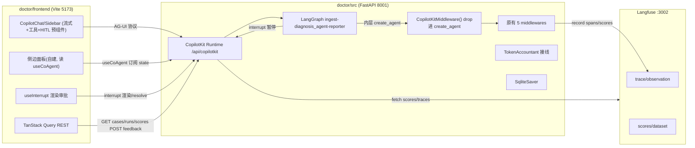

# DiagDoctor 诊断对话前端（完整版）实施计划

> 本文档是前后端配套实施的逐步跟进清单。每个 Phase 都列出了**目标 / 涉及文件 / 具体步骤 / 验收标准**，可独立完成并验收后再进入下一阶段。
>
> **产品形态**：面向用户的**诊断对话应用**——用户输入 bug 内容（user_report + 可选日志/trace/浏览器错误），通过对话式界面观看诊断过程（流式推理 + 工具调用 + 审批），最终拿到结构化诊断报告。**不是开发者用的可观测性控制台**。
>
> 时点：本计划基于 V4（`create_agent` + 5 middleware）后端现状制定。后端调研结论见文末「附录 A：后端现状速查」。

---

## 0. 总览

### 0.1 目标功能（8 项）

| # | 功能 | 价值 | 落地 Phase |
|---|------|------|-----------|
| 1 | 流式诊断对话（LLM token + 工具调用内联渲染） | 核心 | P1 |
| 2 | 工具调用 generative UI 卡片（展开看 args/result/latency/dedup） | 差异化 | P1 |
| 3 | 实时预算 / Token / Cost 侧边面板 | 生产意识 | P1 + P4 |
| 4 | HITL 工具审批 + 方向注入（useInterrupt） | 高价值 | P3 |
| 5 | 证据链可视化（golden_signals → correlations → findings → report） | 后端价值显性化 | P2 |
| 6 | 评测面板（9 维分数 + run 对比） | 评测闭环 | P5 |
| 7 | 反馈回流标注（纠错 → Langfuse score + 本地集） | 评测飞轮 | P6 |
| 8 | 多 Case 管理 + Langfuse trace 跳转 | 可观测性 | P5 + P7 |

### 0.2 技术栈（已选路线 B：CopilotKit）

- **前端核心**：React 18 + Vite + TypeScript + Tailwind + **CopilotKit**（`@copilotkit/react-core` + `@copilotkit/react-ui`）
- **诊断交互面**：CopilotKit 预组件（`CopilotChat` / `CopilotSidebar`）—— 自带流式、工具调用渲染、generative UI、HITL，slot 系统可逐层替换样式/子组件
- **结构化侧面板**（自建，读 `useCoAgent` 订阅的 LangGraph state）：BudgetDashboard、EvidenceChainGraph、ReportPanel
- **状态**：CopilotKit `useCoAgent`（agent state 同步，替代自建事件总线）+ TanStack Query（评测/反馈 REST）+ Zustand（仅本地 UI 态）
- **可视化**：reactflow（证据链图）、recharts（评测雷达图）
- **后端**：FastAPI + **CopilotKit FastAPI runtime**（暴露 LangGraph agent，替代手写 SSE 事件总线）+ `CopilotKitMiddleware()`（drop 进现有 `create_agent` middleware 列表）+ LangGraph `interrupt()`/`Command(resume=)`（HITL）

> **关键转变**：原计划自建 asyncio.Queue 事件总线 + 手写 SSE drain（P1）和自建 interrupt/resume 端点（P3）的两大重活，改由 CopilotKit 的 AG-UI runtime + `useInterrupt` 接管。代价是诊断交互形态从「控制台」变为「chat + 侧边面板」。

### 0.3 目录约定

- 前端：`doctor/frontend/`（与 doctor 包同级，CORS 已放行 5173）
- 后端：`doctor/src/main.py` 挂载 CopilotKit runtime；`doctor/src/graph/subgraphs/diagnosis_agent.py` 追加 `CopilotKitMiddleware()`；新增 `doctor/src/graph/nodes/diagnosis_agent/middleware/hitl_approval.py`、`doctor/src/observability/pricing.py`、`doctor/src/api/{cases,runs,feedback}.py`

### 0.4 架构与数据流



> 与原计划对比：SSE 事件总线消失，改为 CopilotKit AG-UI runtime 统一承载流式/工具/HITL；预算与证据链数据通过 `useCoAgent` 订阅 LangGraph state 获取，不再需要 middleware 往 queue put 事件。

---

## Phase 0：脚手架与基础设施

### 目标
搭好前端工程骨架与后端类型契约基础，跑通空白页 + 健康检查联通。

### 涉及文件
- 新建：`doctor/frontend/`（整个 Vite 工程）
- 修改：`doctor/pyproject.toml`（加 `copilotkit` 依赖）、`doctor/src/main.py`（挂载 CopilotKit runtime）、`doctor/src/graph/subgraphs/diagnosis_agent.py`（middleware 列表加 `CopilotKitMiddleware()`）

### 具体步骤
1. `npm create vite@latest doctor/frontend -- --template react-ts`
2. 安装前端依赖：`@copilotkit/react-core`、`@copilotkit/react-ui`、`react-router-dom`、`@tanstack/react-query`、`reactflow`、`recharts`、`tailwindcss`、shadcn/ui（按官方 init）、`lucide-react`、`zustand`
3. 配置 Tailwind + shadcn/ui，建立 `src/components/ui/`
4. 目录结构：`src/api/`（REST client + types）、`src/features/{diagnosis,eval}/`、`src/pages/`、`src/main.tsx`、`src/App.tsx`
5. 路由：`/` → DiagnosePage（诊断对话）、`/eval` → EvalPage、`/cases/:id` → CasePage、`/runs/:name` → RunPage（占位组件）
6. 后端：`uv add copilotkit`；在 `main.py` 用 CopilotKit 的 FastAPI 集成挂载 `/api/copilotkit` runtime，注册 diagnosis agent（暴露编译后的 LangGraph 图）
7. 后端：`subgraphs/diagnosis_agent.py` 的 `create_agent(middleware=[...])` 列表**末尾追加** `CopilotKitMiddleware()`（不动原有 5 个 middleware 顺序，CopilotKit 的转发逻辑放在最内层即可）
8. `src/api/client.ts`：fetch 封装（baseURL `http://localhost:8001`），用于评测/反馈 REST
9. `src/api/types.ts`：手写 TS 类型对应后端 Pydantic（`DiagnosisReport`、`BudgetState`、`Finding`、`NormalizedEvidence`、`Signal`、`Correlation`、`TimelineEvent`、`Evidence`）
10. 顶层 `CopilotKit` Provider 包裹（`runtimeUrl="/api/copilotkit"` + `agent="diagnosis"`），导航栏 + 暗色主题
11. **Spike 验证**：在 DiagnosePage 放一个最小 `CopilotChat`，发一句 "test"，确认能连到后端 agent 并收到流式回包（验证 CopilotKitMiddleware + runtime + 多节点图打通）

### 验收标准
- 前端起 5173，4 路由可切；`CopilotKit` Provider 就位
- 后端 `/api/copilotkit` 可用；最小 `CopilotChat` 能与 diagnosis agent 流式对话（即使 agent 还没接证据输入也算打通）
- spike 确认：外层 3 节点图（ingest→diagnosis_agent→reporter）能否被 CopilotKit 当作一个 agent 暴露。若不能，记录卡点，Phase 1 先解决

---

## Phase 1：流式诊断对话（最关键，端到端跑通）

### 目标
用户在 `CopilotChat` 输入 bug 内容，看到流式推理 + 工具调用 generative UI 卡片 + 侧边预算面板实时更新。CopilotKit 承载流式/工具/HITL，**不再自建 SSE 事件总线**。

### 涉及文件
- 后端：
  - `doctor/src/graph/subgraphs/diagnosis_agent.py`（确认 `CopilotKitMiddleware()` 已加）
  - `doctor/src/graph/state.py`（确保 `budget`/`evidence`/`findings`/`report` 在 DoctorState 中可被 CopilotKit state 同步）
  - `doctor/src/graph/nodes/diagnosis_agent/middleware/budget_guard.py`（确认 `ctx_budget` 写回 DoctorState.budget 的路径，供 useCoAgent 订阅）
  - `doctor/src/graph/nodes/diagnosis_agent/node.py`（确保中间 state 增量可见——见下方「state 可见性」说明）
- 前端：
  - `src/pages/DiagnosePage.tsx`（布局：左 CopilotChat + 右侧边面板）
  - `src/features/diagnosis/CaseInputChat.tsx`（包 `CopilotChat`，配置 labels/welcomeMessage）
  - `src/features/diagnosis/ToolCallCard.tsx`（generative UI：用 `useRenderToolCall` 渲染工具调用卡片）
  - `src/features/diagnosis/BudgetPanel.tsx`（侧边面板，读 `useCoAgent` state.budget）
  - `src/features/diagnosis/ReportPanel.tsx`（最小版，读 state.report，完整版在 P2）

### 关键机制说明

**流式与工具调用**：CopilotKit 的 `CopilotChat` 经 AG-UI 协议自动接收 LLM token 流和工具调用事件，无需手写 SSE。工具调用用 `useRenderToolCall(({ name, args, result, status }) => ...)` 注册自定义卡片渲染，显示工具名/args（可展开）/result/latency/dedup 跳过标记。

**预算/证据实时数据**：用 `useCoAgent` 订阅 LangGraph state。`const { state } = useCoAgent({ name: "diagnosis" })`，`state.budget` / `state.evidence` / `state.findings` 变化时组件自动重渲染。

**state 可见性注意**：LangGraph state 默认只在节点边界更新。`budget_guard` 的 `ctx_budget` 在 middleware 内实时变但写在 ContextVar，不会自动同步到前端。两条路：
- **方案 1（推荐）**：在 `budget_guard.abefore_model` 把 `ctx_budget.to_dict()` 写入 DoctorState 的一个可增 reducer 字段（如 `budget_tick`），让 CopilotKit state 同步能推到前端
- **方案 2**：前端 BudgetPanel 改用轮询/降级只在节点结束更新（粒度粗，不推荐）
先做方案 1 的 spike，确认 CopilotKit 能否推送高频 state 增量；若不行，回退方案 2 并在 P4 用 Langfuse polling 补足实时性。

### 具体步骤
1. **后端**：在 `DoctorState` 加一个 `budget_ticks: Annotated[list, add]`（或类似可增字段），`budget_guard.abefore_model` 每轮 append 当前 `ctx_budget.to_dict()`，使中间预算可被 CopilotKit 同步
2. **后端**：确认 `evidence`（ingest 后）、`findings`、`report` 已在 DoctorState（已存在），CopilotKit state 同步可直接用
3. **前端 DiagnosePage**：左 60% 放 `CopilotChat`（welcomeMessage 引导用户描述 bug + 粘贴日志/trace），右 40% 放 BudgetPanel
4. **前端 CaseInputChat**：配置 `labels`、`suggestions`（如「试试一个 backend 500 case」）
5. **前端 ToolCallCard**：`useRenderToolCall` 注册全局工具渲染，覆盖所有诊断工具（search_observability/code_search/db_query 等），卡片含展开/折叠、latency、dedup 灰显
6. **前端 BudgetPanel**：`useCoAgent` 读 `state.budget_ticks` 最新一项 + `state.budget`，渲染 iteration/12、tool_calls、total_used/100k、usage_ratio、phase、elapsed、early_stopped 高亮
7. **联调**：发起一个 smoke case，确认聊天流式 + 工具卡片 + 预算条都实时

### 验收标准
- 用户在 CopilotChat 输入 bug 描述，看到流式推理文本
- 每次工具调用出现可展开卡片，dedup 调用灰显「跳过」
- 右侧 BudgetPanel 随 agent 推进实时增长（iteration/token/tool_calls）
- 诊断结束 ReportPanel 显示 `state.report`
- 后端 benchmark（走非 CopilotKit 的 `/api/diagnose`）不受影响——双入口并存

---

## Phase 2：证据链与结构化报告

### 目标
扩展非流式响应，前端渲染证据链有向图 + 完整报告。

### 涉及文件
- 后端：`doctor/src/api/diagnose.py`（`DiagnoseResponse` 扩展 + SSE `final` 事件携带）
- 前端：`src/features/diagnosis/EvidenceChainGraph.tsx`、`src/features/diagnosis/ReportPanel.tsx`

### 具体步骤
1. **后端**：`DiagnoseResponse` 增加 `budget`、`findings`、`evidence`（NormalizedEvidence）、`correlations`、`timeline` 字段；从 graph 最终 state 取出
2. **后端**：SSE `final` 事件同样携带这些字段（避免前端流式结束还要再请求一次）
3. **前端 EvidenceChainGraph**：用 reactflow 构建节点：
   - 左侧：`golden_signals`（每个 Signal 一个节点，按 source 着色）
   - 中间：`correlations`（关联多条 signal 的边）
   - 右侧：`findings`（Finding 节点，带 confidence）
   - 终点：`report`（root_cause + evidence_chain 高亮路径）
   - 边：`evidence_ref` 字符串作为连线依据，`raw_refs` 解析
4. **前端 ReportPanel**：结构化展示 `primary_category`、`root_cause`、`affected_file:line`（可点击高亮证据链对应节点）、`fix_suggestion`、`confidence` 进度条、`early_stopped` 标记、`notes`

### 验收标准
- 诊断完成后，证据链图正确连线，点击 report 的 evidence_ref 能高亮对应 signal 节点
- ReportPanel 字段齐全且与后端 `DiagnosisReport` 一致

---

## Phase 3：HITL 工具审批与方向注入

### 目标
高危工具执行前暂停等人工审批；支持注入方向性 guidance。改用 CopilotKit 的 `useInterrupt` + LangGraph `interrupt()`，**不自建 resume 端点**。

### 涉及文件
- 后端：
  - 新建 `doctor/src/graph/nodes/diagnosis_agent/middleware/hitl_approval.py`（`interrupt()` 暂停）
  - `doctor/src/graph/main_graph.py`（`MemorySaver` → `SqliteSaver`，interrupt 需持久化 checkpoint）
  - `doctor/src/config.py`（SqliteSaver 路径 + 高危工具白名单 `HITL_DANGEROUS_TOOLS`）
- 前端：`src/features/diagnosis/HITLApprovalDialog.tsx`（`useInterrupt` 渲染合同）

### 关键机制（CopilotKit useInterrupt 模式）
- **后端**：`hitl_approval.py` 在 `awrap_tool_call` 前对高危工具调用 LangGraph 原生 `interrupt({"tool": name, "args": args, "call_id": ...})`，图暂停、checkpoint 落库
- **前端**：`useInterrupt({ render: ({ event, resolve }) => <HITLApprovalDialog .../> })` 作为渲染合同——CopilotKit 收到 interrupt 事件后自动挂起对话、渲染组件，用户操作后调 `resolve(value)` 把答案送回图，agent 继续
- **resume 由 CopilotKit runtime 自动处理**（基于 AG-UI 协议 + checkpointer），无需手写 `/api/diagnose/resume`

### 具体步骤
1. **后端 config**：`HITL_DANGEROUS_TOOLS = {"db_query", "code_search"}`、`checkpointer_sqlite_path`
2. **后端 main_graph.py**：`_get_checkpointer()` → `SqliteSaver.from_conn_string(path)`（interrupt 必须配持久化 checkpointer）
3. **后端 hitl_approval.py**：`awrap_tool_call` 前判断 `tool_name in HITL_DANGEROUS_TOOLS` → `interrupt({"tool", "args", "call_id"})`；注册顺序放在 `ToolDedup` 之后、`LangfuseTracing` 之前（审批后再 trace/执行）
4. **前端 HITLApprovalDialog**：`useInterrupt` 的 `render` 收到 `{event, resolve}`，展示工具名 + args（JSON 可编辑）、按钮：
   - 通过 → `resolve({"approved": true})`
   - 修改后通过 → `resolve({"approved": true, "args": modified})`
   - 拒绝 → `resolve({"approved": false, "reason": ...})`（agent 收到拒绝反馈继续推理）
   - 注入方向 → 作为新消息发到 `CopilotChat`（不通过 interrupt resolve，走正常对话注入）
5. **联调**：发起含 `db_query` 的诊断，确认对话暂停、弹审批框、resolve 后 agent 继续

### 验收标准
- 高危工具执行前对话暂停，前端弹审批框
- 拒绝后工具不执行、agent 收到拒绝反馈继续推理；修改参数后通过则用新参数执行
- 重启后端后，同 thread 的暂停 run 仍可 resume（SqliteSaver 持久化 + CopilotKit runtime 恢复）

### 风险
- **`create_agent` + middleware 层的 `interrupt` 支持需 spike 验证**。CopilotKit 官方示例多在 graph node 内 `interrupt()`，middleware `awrap_tool_call` 内 `interrupt()` 是否被外层 checkpointer 正确捕获需确认。**回退方案**：若不生效，把审批逻辑上移到 `diagnosis_agent_node` 手动驱动循环（docs 方向 0 已论证路径），在循环内显式 `interrupt()`。先 spike 再全面铺开。
- CopilotKit runtime 对 SqliteSaver 的 resume 支持需确认版本兼容性

---

## Phase 4：Cost 接线

### 目标
让 `total_cost_usd` 真实生效，仪表盘显示 cost。

### 涉及文件
- 后端：
  - 新建 `doctor/src/observability/pricing.py`（模型定价表）
  - `doctor/src/observability/cost.py`（TokenAccountant 已存在，接线）
  - `doctor/src/graph/nodes/diagnosis_agent/middleware/langfuse_tracing.py`（on_llm_end 记账）
  - `doctor/src/graph/nodes/diagnosis_agent/budget.py`（写入 `total_cost_usd`）
  - `doctor/src/graph/context_engine.py`（ContextBudget 加 `cost_usd` 字段）

### 具体步骤
1. **pricing.py**：`MODEL_PRICING: dict[str, tuple[float, float]]`（input_per_1k, output_per_1k），覆盖 DeepSeek/GPT/Claude 等用到的模型；从 `llm_factory.get_llm_for_role` 返回的 model name 查找
2. **ContextBudget**：加 `cost_usd: float = 0.0`，`add_llm_call(model, prompt_tokens, completion_tokens)` 方法算价累加
3. **LangfuseTracingMiddleware**：`on_llm_end` 回调里从 `usage_metadata` 取 `input_tokens`/`output_tokens`，调 `ctx.ctx_budget.add_llm_call(model, ...)`，同时 `accountant.record(...)`
4. **budget.py update_budget**：把 `ctx.ctx_budget.cost_usd` 写入 `BudgetState.total_cost_usd`
5. **SSE**：`budget_tick` 与 `final` 事件携带 `cost_usd`
6. **前端 BudgetDashboard**：显示累计 cost，可按模型拆分（如有多模型）

### 验收标准
- 一次诊断结束后 `BudgetState.total_cost_usd` > 0 且与 Langfuse usage 交叉验证一致
- 仪表盘 cost 随 LLM 调用实时增长

---

## Phase 5：评测面板与多 Case 管理

### 目标
展示 run 列表、9 维分数、case 目录，支持 Langfuse trace 跳转。

### 涉及文件
- 后端：新建 `doctor/src/api/cases.py`、`doctor/src/api/runs.py`；`doctor/src/main.py` 注册
- 前端：`src/features/eval/RunList.tsx`、`RunScoreboard.tsx`、`CaseCatalog.tsx`、`CaseDetailCompare.tsx`、`src/pages/EvalPage.tsx`、`RunPage.tsx`、`CasePage.tsx`

### 具体步骤
1. **后端 cases.py**：`GET /api/cases` 读 `bug-factory/recipes/gold/*.yaml`，返回 `[{recipe_id, title, category, categories, split, difficulty, severity, expected_diagnosis}]`，支持 `?split=` 过滤
2. **后端 runs.py**：
   - `GET /api/runs`：glob `doctor/scripts/_scores_*.json` → `[{run_name, case_count, created_at}]`
   - `GET /api/runs/{run_name}/scores`：返回对应 `_scores_*.json` 数组
   - `GET /api/runs/{run_name}/cases/{recipe_id}`：合并 trace.output.diagnosis_report + dataset expected_output + `trace_url = f"{langfuse_host}/trace/{trace_id}"`
3. **前端 RunList**：列表 + 进入 RunPage
4. **前端 RunScoreboard**：recharts 雷达图（9 维）+ 表格（每 case 一行）+ 均值汇总
5. **前端 CaseCatalog**：15 case 卡片，按 split 筛选，点击进入 CasePage
6. **前端 CaseDetailCompare**：diagnosis vs expected_output 并排，字段级颜色标注一致/不一致；「在 Langfuse 查看」按钮跳 `trace_url`

### 验收标准
- `/eval` 页能看到所有 run，点进能看到雷达图与每 case 分数
- case 目录 15 条齐全，split 筛选正确
- Langfuse 跳转链接正确打开 trace

---

## Phase 6：反馈回流标注

### 目标
人工纠错 → 回写 Langfuse score + 本地集，形成评测飞轮。

### 涉及文件
- 后端：新建 `doctor/src/api/feedback.py`
- 前端：`src/features/eval/FeedbackForm.tsx`、`CaseDetailCompare.tsx` 内嵌

### 具体步骤
1. **后端 feedback.py**：`POST /api/feedback`
   ```python
   class FeedbackRequest(BaseModel):
       trace_id: str
       recipe_id: str
       run_name: str | None
       corrected_field: str  # root_cause / affected_file / ...
       value: str
       note: str | None
   ```
   - 调 Langfuse `client.score(trace_id=..., name=f"human_correction_{field}", value=..., comment=note)`
   - 追加写 `doctor/scripts/_feedback.jsonl`（一行一条）
   - 返回 `{status, feedback_id}`
2. **前端 FeedbackForm**：在 CaseDetailCompare 每个字段旁加「纠错」按钮，弹出表单（corrected_field 预填、value 输入、note 可选）→ POST
3. **前端**：提交成功后 toast，并刷新该 case 的标注状态

### 验收标准
- 提交纠错后 `_feedback.jsonl` 新增一行，Langfuse trace 上出现对应 score 注释
- 同一字段可多次纠错（保留历史）

---

## Phase 7：收尾打磨

### 目标
类型同步、错误处理、文档与可演示性。

### 具体步骤
1. **类型同步**：加 `pydantic2ts` 到 `doctor/scripts/gen_ts_types.py`，从 `graph/state.py` 生成 `src/api/types.ts`，CI 校验漂移
2. **错误/重连/空态**：SSE 断线重连、`error` 事件 UI、各页面空态/loading 态
3. **README**：`doctor/frontend/README.md`（启动、env、端口）+ 在主 README 加前端章节
4. **启动脚本**：`docker-compose.yml` 加 `doctor-frontend` 服务；或 root `package.json` script
5. **截图与演示路径**：录一条 smoke case 的完整流式诊断流程，作为 demo
6. **CORS 核对**：确认 `doctor/src/config.py` CORS 列表含 5173（已含）

### 验收标准
- `types.ts` 由脚本生成且与后端一致
- 断网/后端重启后前端能恢复
- 一条命令启动前后端

---

## 附录 A：后端现状速查（制定本计划的依据）

| 维度 | 现状 | 影响 |
|------|------|------|
| API | FastAPI `doctor/src/main.py` 8001，`/api/diagnose`(非流式) `/health` | 保留作为 benchmark 入口；新增 CopilotKit runtime（P0） |
| 流式 | 现有 `?stream=true` SSE 只发 LLM token + report | **改由 CopilotKit AG-UI runtime 承载**（P0/P1），原 SSE 可弃用 |
| `DiagnoseResponse` | 只有 report 摘要 + findings_count | P2 扩展（评测/case 详情 REST 用） |
| 事件总线 | 无；`DiagnosisRunContext` ContextVar 仅活于 ainvoke 期间 | **不再自建**；改用 CopilotKit `useCoAgent` 订阅 LangGraph state |
| `ContextBudget` | 有 `to_dict()` 但从不外发 | P1 写入 DoctorState 可增字段供 useCoAgent 同步 |
| CopilotKit 兼容 | V4 已用 `create_agent(middleware=[...])` | **天然兼容**：列表追加 `CopilotKitMiddleware()` 即可（P0） |
| HITL | 无 `interrupt`/`Command(resume)`；MemorySaver 未用于暂停 | **必须新建**（P3）：`interrupt()` + `useInterrupt` |
| Checkpointer | `MemorySaver`（内存） | **需换 SqliteSaver**（P3，interrupt 必须持久化） |
| `TokenAccountant` | 存在于 `observability/cost.py`，未接线 | **必须接线**（P4） |
| `BudgetState.total_cost_usd` | 不更新 | P4 修复 |
| 评测数据 | 15 gold recipes + `_scores_*.json`（9 维）+ Langfuse trace | 已就绪（P5 消费） |
| 反馈/标注 API | 无 | **必须新建**（P6） |
| Langfuse trace URL | `{langfuse_host}/trace/{trace_id}`，host 默认 3002 | 直接用（P5/P7） |
| CORS | 已放行 5173/3000 | 无需改 |
| 现有前端 | 仅 `demo-app/frontend`（TaskFlow） | 新建 `doctor/frontend` |

## 附录 B：关键文件路径索引

**后端**
- API 入口：`doctor/src/main.py`（挂载 CopilotKit runtime）、`doctor/src/api/diagnose.py`（benchmark 非流式入口，保留）
- 图：`doctor/src/graph/main_graph.py`、`doctor/src/graph/state.py`
- 诊断节点：`doctor/src/graph/nodes/diagnosis_agent/node.py`
- 子图与 middleware 注册：`doctor/src/graph/subgraphs/diagnosis_agent.py`（追加 `CopilotKitMiddleware()`）
- Middleware：`doctor/src/graph/nodes/diagnosis_agent/middleware/`（run_context、tool_dedup、langfuse_tracing、tool_truncation、budget_guard、forced_call、新增 hitl_approval）
- 上下文预算：`doctor/src/graph/context_engine.py`
- 成本：`doctor/src/observability/cost.py`、`pricing.py`（新建）、`langfuse_tracing.py`
- 评测脚本：`scripts/eval_agent.py`、`fetch_experiment_scores.py`、`langfuse_scorers.py`
- Gold cases：`bug-factory/recipes/gold/*.yaml`

**前端（待建）**
- 工程根：`doctor/frontend/`
- API 层：`doctor/frontend/src/api/{client,types}.ts`（REST 评测/反馈用）
- CopilotKit 集成：`doctor/frontend/src/main.tsx`（`CopilotKit` Provider）、各页面用 `CopilotChat`/`useCoAgent`/`useInterrupt`/`useRenderToolCall`
- 诊断特性：`doctor/frontend/src/features/diagnosis/`（CaseInputChat、ToolCallCard、BudgetPanel、EvidenceChainGraph、ReportPanel、HITLApprovalDialog）
- 评测特性：`doctor/frontend/src/features/eval/`

## 附录 C：关键风险与对策

| 风险 | 对策 |
|------|------|
| 外层 3 节点图（ingest→diagnosis_agent→reporter）能否被 CopilotKit 当单一 agent 暴露 | P0 必做 spike；若不行，需在 CopilotKit runtime 注册时包装，或把 agent 入口适配为 CopilotKit 期望的形态 |
| `useCoAgent` 推送高频 state 增量（每轮 budget_tick）的性能/支持度 | P1 spike；若不支持高频增量，BudgetPanel 降级为节点边界更新 + Langfuse polling 补实时性 |
| `create_agent` + middleware 层 `interrupt()` 不被外层 checkpointer 捕获 | P3 先 spike；回退方案：审批逻辑上移到 `diagnosis_agent_node` 手动驱动循环（docs 方向 0），循环内显式 `interrupt()` |
| CopilotKit 版本快速演进、API 变更（如 `renderAndWaitForResponse` 已废弃） | 锁定明确版本；用 `useInterrupt`/`useHumanInTheLoop`(`render`) 新 API，避开废弃接口 |
| SqliteSaver 并发写 | 单连接 or 每 thread 一库；按 LangGraph 官方推荐配置 |
| 双入口并存（CopilotKit runtime + `/api/diagnose`） | benchmark/脚本继续走 `/api/diagnose` 非流式，避免影响回归；前端走 CopilotKit runtime |
| 模型定价表过期 | `pricing.py` 集中维护，加注释标注数据来源与日期 |
| Pydantic ↔ TS 类型漂移 | `pydantic2ts` 脚本 + CI 校验（P7） |

---

## 进度勾选

- [ ] Phase 0：脚手架与基础设施（含 CopilotKit runtime + middleware 接入 spike）
- [ ] Phase 1：流式诊断对话（CopilotChat + useRenderToolCall + useCoAgent 预算面板）
- [ ] Phase 2：证据链与结构化报告
- [ ] Phase 3：HITL 工具审批与方向注入（interrupt + useInterrupt）
- [ ] Phase 4：Cost 接线
- [ ] Phase 5：评测面板与多 Case 管理
- [ ] Phase 6：反馈回流标注
- [ ] Phase 7：收尾打磨